# NSB 蛇行流路（trama パターン）の収束不良 — 3 つの観点からの可視化

[<- README](../../README.md) | [nsb](../../nsb/README.md) | [status-44](../status/status-44.md)

作成 2026-09-09。ブランチ `claude/nsbm-learned-init`。スクリプトは `experiments/nsb/trama_*.py`、
ログは `experiments/nsb/logs/trama-*.log`、結果は `experiments/nsb/results/trama_*`。

## 0. 全体像

<div style="overflow-x:auto"><svg viewBox="0 0 980 300" width="100%" style="min-width:640px" xmlns="http://www.w3.org/2000/svg" font-family="sans-serif" font-size="13">
  <defs><marker id="ar" markerWidth="8" markerHeight="8" refX="7" refY="4" orient="auto"><path d="M0,0 L8,4 L0,8 z" fill="#52514e"/></marker></defs>
  <rect x="10" y="20" width="200" height="70" rx="8" fill="#cde2fb" stroke="#2a78d6"/>
  <text x="110" y="45" text-anchor="middle" font-weight="bold">Newton + 擬似時間（SER）</text>
  <text x="110" y="65" text-anchor="middle">場 x → 残差 R(x)、CFL</text>
  <text x="110" y="82" text-anchor="middle" font-size="11">出発点は Stokes 参照場</text>
  <rect x="280" y="20" width="230" height="70" rx="8" fill="#cde2fb" stroke="#2a78d6"/>
  <text x="395" y="45" text-anchor="middle" font-weight="bold">線形系 (J_true + 2τ) δ = −R</text>
  <text x="395" y="65" text-anchor="middle">JFNK: 有限差分 matvec（真の作用素）</text>
  <text x="395" y="82" text-anchor="middle" font-size="11">右前処理 FGMRES、真の残差で棄却判定</text>
  <rect x="580" y="20" width="230" height="70" rx="8" fill="#cde2fb" stroke="#2a78d6"/>
  <text x="695" y="45" text-anchor="middle" font-weight="bold">前処理 M ≈ (J1 + τ)⁻¹</text>
  <text x="695" y="65" text-anchor="middle">J1: 1 次風上・RC 係数凍結</text>
  <text x="695" y="82" text-anchor="middle" font-size="11">SIMPLE 型（運動量 ILU + Schur SA-AMG）</text>
  <line x1="210" y1="55" x2="278" y2="55" stroke="#52514e" stroke-width="1.5" marker-end="url(#ar)"/>
  <line x1="510" y1="55" x2="578" y2="55" stroke="#52514e" stroke-width="1.5" marker-end="url(#ar)"/>
  <rect x="10" y="130" width="300" height="150" rx="8" fill="#fff" stroke="#eb6834"/>
  <text x="20" y="152" font-weight="bold" fill="#eb6834">観点 1: 高 Re</text>
  <text x="20" y="172">a_P が対流支配（対流割合 0.50 → 0.99）</text>
  <text x="20" y="190">RC 結合 d_f = V/a_P が 50 倍弱まる</text>
  <text x="20" y="208">→ J1 の圧力方向がほぼ平ら、Newton ステップの</text>
  <text x="20" y="226">圧力成分 |δp| が ṁ^2.6 で伸びる（60 → 8.4e6）</text>
  <text x="20" y="244">→ その方向で J1 と真の作用素が食い違う</text>
  <text x="20" y="262" font-weight="bold">厳密ステップの真の残差比 1.16 → 81</text>
  <rect x="340" y="130" width="300" height="150" rx="8" fill="#fff" stroke="#1baf7a"/>
  <text x="350" y="152" font-weight="bold" fill="#1baf7a">観点 2: 斜め流路の階段</text>
  <text x="350" y="172">階段セル 203（流路セルの 0.8%）</text>
  <text x="350" y="190">残差・食い違いの分担は 1% 程度</text>
  <text x="350" y="208">斜め区間を直交化しても未収束</text>
  <text x="350" y="226">直線流路は 0/15/30/45° どれも健全</text>
  <text x="350" y="244">（同じ Re・ポート・格子で Ritz 0.03〜1.03）</text>
  <text x="350" y="262" font-weight="bold">無関係。引き金は蛇行の U ターン</text>
  <rect x="670" y="130" width="300" height="150" rx="8" fill="#fff" stroke="#4a3aa7"/>
  <text x="680" y="152" font-weight="bold" fill="#4a3aa7">観点 3: 前処理の弱点</text>
  <text x="680" y="172">SIMPLE の Schur 近似が高 Re で崩れ、</text>
  <text x="680" y="190">A M⁻¹ の Ritz 値が 1e-4 〜 3e6 に散る</text>
  <text x="680" y="208">→ Krylov 空間が J1 のほぼ零空間（閉塞域の圧力）</text>
  <text x="680" y="226">を 1e9 倍に増幅し、そこで有限差分と食い違う</text>
  <text x="680" y="244">→ Givens 推定 0.077 なのに真の残差 30</text>
  <text x="680" y="262" font-weight="bold">LU(J1) なら 3e-3 で解ける</text>
</svg></div>

**結論を先に。** 0.15 kg/s（Re_h ≈ 1450）で最初の Newton 反復から線形解が「真の残差比 4.1」で棄却され、
CFL が 1/10 ずつ縮み続けて落ちる。原因は「高 Re」「前処理」の 2 観点が**同じ場所（閉塞領域と出口円板の
圧力レベル方向）で重なる**ことにあり、階段（観点 2）は無関係。CFL を縮めても直らないのは、擬似時間対角 τ が
速度方向しか正則化せず、**圧力の谷底には手が届かない**ため（§5 の CFL 1e-6 実験）。

| 観点 | 症状の数字（0.0015 → 0.15 kg/s） | 判定 |
|---|---|---|
| 1. 高 Re | κ₂(J1+τ) は 1.6e12 → 2.1e12 と**ほぼ不変**。変わるのは厳密 J1 ステップの真の残差比 1.16 → **81**、圧力ステップ 60 → **8.4e6** | 主因（J1 と真の作用素の食い違い） |
| 2. 階段 | 階段セルの残差分担 ≈ 1%。直交化版も未収束。直線流路は 0〜45° どの角度でも健全 | 無関係。引き金は蛇行の U ターンで Stokes 出発点が遠いこと（\|R_ref\| 190 vs 直線 7.2） |
| 3. 前処理 | SIMPLE: Givens 0.077 / 真 **30**。LU(J1): 真 **3.3e-3**。ただし LU でも Newton ステップで残差 **5060 倍** | 主因（SIMPLE が観点 1 の弱点を増幅）。線形解を直してもステップの方向が悪い |
| 追加: ポート | κ は内部 2.1e12 / 壁 2.3e12 で同等。厳密ステップの真の残差比は内部 81 / 壁 1.6 | 内部ポートが食い違いを 50 倍増やす |

副次的発見: JFNK の有限差分 matvec は擬似時間対角 τ を **2 重に**数えている（真の作用素 J+2τ、前処理は J1+τ）。
発散の原因ではないが、CFL の実効値が半分になり、前処理と作用素の食い違いをひとつ増やしている（§6）。

## 1. ケース

`../tmp/pattern.json`（messi trama、1 エッジ、幅 7 unit、via 12 点、斜め区間 1 つ）を
一様スケール 4.93 mm/unit で 600×350 mm の中央に置いた（「横 600、縦 350」は領域サイズと解釈。
bbox を非等方に引き伸ばすと流路幅が方向で変わるので採らなかった）。左端 2 ノードを内部セルの
inlet（`interior_source`、円板 r = 幅/2）/ outlet（`interior_pressure_sink`、C = 1e-3 kg/(s·Pa)）にした。

| 量 | 値 |
|---|---|
| 格子 | 400 × 233、Δx = 1.5 mm |
| 流路幅 | 34.5 mm（23 セル）、経路長 1.61 m |
| h_channel / h_blocked | 3.8e-3 / 1e-5 m → Brinkman 抵抗 12μ/h² = 2.5e3 / 3.6e8 kg/(m³s)（比 1.4e5） |
| ρ, μ, ṁ | 1000, 3e-3, 0.15 kg/s → 平均流速 1.14 m/s |
| Re_h / Re_2h / Re_cell | 1449 / 2898 / 572 |

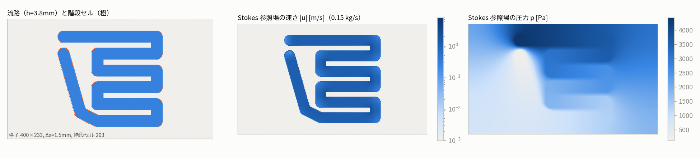

再現（`python experiments/nsb/trama_case.py --mass 0.15`、既定設定 jfnk_simple / sou / cfl_init 0.25）:

```
[nsb] it=1 linear solve failed (gmres=200, |b-Ax|/|b|=4.09e+00), rejected, cfl -> 0.025
[nsb] it=2 linear solve failed (gmres=200, |b-Ax|/|b|=1.00e+00), rejected, cfl -> 0.0025
[nsb] it=3 linear solve failed (gmres=200, |b-Ax|/|b|=9.91e-01), rejected, cfl -> 0.00025
...（CFL 1e-38 まで縮んで max_iter）
```

0.0015 kg/s（1/100）は最初のステップで残差が 6.6 倍に跳ね、CFL 0.03 で立て直して 80 反復で rel 3.7e-6
（判定 1e-6 にあと一歩。反復上限を上げれば収束する形）。「1/100 なら収束」と整合する。

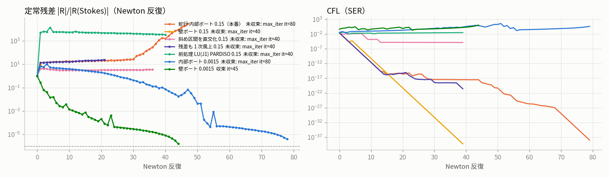

## 2. 舞台: 線形系の幾何

3N 次元（u, v, p）の空間で、前処理行列 J1+τ の特異値スペクトルの**両端はどちらも閉塞領域**が決める。

- **最大 σ_max ≈ 811** = 閉塞セルの Brinkman 対角 12μ/h²·V = 3.6e8 × 2.25e-6。ṁ にもポートにも依らない。
- **最小 σ_min ≈ 4e-10〜7e-10** で、対応する右特異ベクトルは **u, v 成分が厳密に 0 の純圧力モード**。
  閉塞ポケットの圧力レベルが、RC 結合 d = V/a_P = 2.8e-9 という極細の管でしか流路に繋がっていない。
- したがって κ₂ ≈ 2e12 は**幾何（閉塞比 1.4e5）で決まり、Re では 1.3 倍しか動かない**。

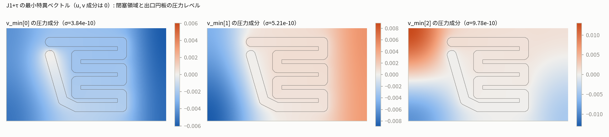

幾何の像: 圧力方向のうち「ポケットの水位」だけが J1 ではほぼ平らな谷底になっている。前処理 M ≈ J1⁻¹ は
この谷底方向を 1/σ_min ≈ 2e9 倍に伸ばす。谷底が真の作用素でも平らなら害はないが、そうではない（§3）。

## 3. 観点 1: 高 Re は条件数ではなく「J1 と真の作用素の食い違い」を悪化させる

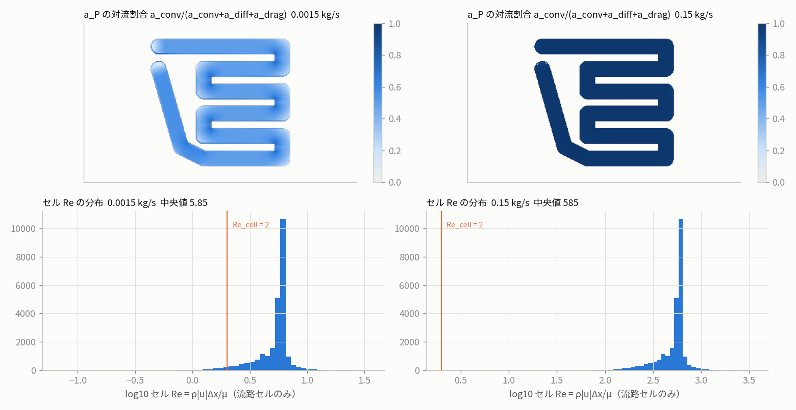

高 Re で起きることを a_P（運動量対角）で読む:

| ṁ [kg/s] | a_P 中央値（流路） | 対流割合 | RC 結合 d = V/a_P（流路） | 流路/ポケットの d 比 |
|---|---|---|---|---|
| 0.0015 | 3.5e-2 | 0.50 | 6.4e-5 | 2.3e4 |
| 0.15 | 1.79 | 0.99 | 1.3e-6 | 450 |

1. **圧力–速度結合が 50 倍弱まる。** a_P が対流（ρ|u|Δy）に支配され、RC 係数 d_f ∝ 1/Re。
   運動量の不釣り合い R（∝ ṁ²）を直すのに必要な圧力ステップは R/d ∝ ṁ³ で伸びる。実測の厳密 J1 ステップの
   圧力成分 |δp| は 60 → 695 → 1.6e4 → 4.6e5 → 8.4e6（ṁ^2.6）。場の |p| は 4.4e3 Pa なので、
   0.15 では**場の 2000 倍の圧力ステップ**を J1 が要求している。
2. **その歩に対する真の作用素の応答が J1 と食い違う。** 厳密に (J1+τ) d = −R を解いた d を有限差分の
   真の作用素に通すと |b − A d|/|b| = 1.16（0.0015）→ 1.05 → 1.91 → 2.40 → **81**（0.15）。
   食い違いの 100% が**出口円板（pressure sink）セルの v 運動量行**に集中する（§5 の局所化）。
   sink の運動量項 q_out·v = C(p − p_sink)·v と RC 質量流束の p 依存が、圧力ステップの巨大さに乗じられる。
3. **蛇行だから起きる。** 直線流路は同じ Re・同じ内部ポートでも Stokes 参照場がほぼ NS 解で
   （|R_ref| 7.2、|x| 1.1e5）、Newton ステップが小さく §5 の機構が発火しない。蛇行は U ターン 6 か所で慣性が
   効き、Stokes 出発点が遠い（|R_ref| 190、|x| 7.2e5、最大速さ 6.85 m/s = 平均の 6 倍）。
   大きな R に 1/d ∝ Re が掛かって圧力ステップが場の外へ飛ぶ。
4. 条件数そのものは動かない（κ 1.6e12 → 2.1e12）。**「高 Re → 条件数悪化」ではなく「高 Re → J1 の
   圧力方向が平らになり、その方向で Newton ステップが場の外へ飛び出す」**が正しい像。

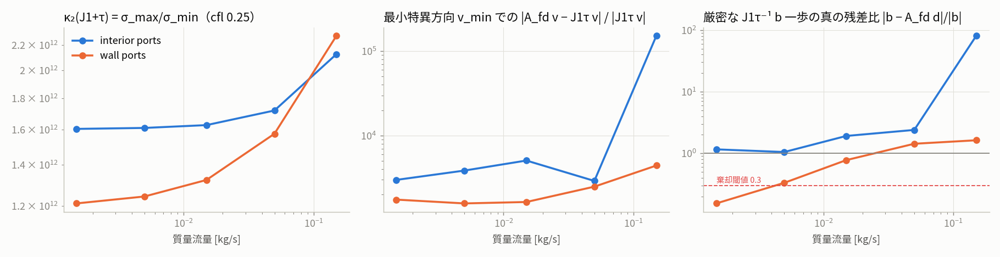

有限差分 matvec が「ノイズ」でないことは ε 掃引で確認した（`trama_epsscan.py`）: v_min に沿った差分商は
ε = 1e-1〜1e-6 で 6.68e-5 に一定（本物の導関数）、J1 v = 3.8e-10 の 1.7e5 倍。ランダムな圧力方向では
J1 と 1e-6 で一致する。食い違いは**滑らかな圧力レベル方向に限って**起きる。

## 4. 観点 2: 斜め流路の階段は主因ではない

- 階段セル（x, y 両方向に閉塞隣接を持つ凸角）は 203 個、流路セル 24,888 の 0.8%。
- 失敗した線形解の残差 |b − Ax|² のセル種別分担: 階段 **1%**、流路内部 64%（u）/ 77%（p）、閉塞 27%（u）/ 41%（v）。
  残差は階段に集中せず、流路内部と閉塞領域に**一様に散る**（前処理が壊した Krylov 空間の痕跡）。
- 斜め区間を直交 2 区間に置換した対照（`--variant ortho`）も 0.15 で未収束（残差 1.5〜4 に停滞、CFL 1e-5）。
  階段が無くても同じ機構で落ちる。
- 直線流路の角度掃引（0/15/30/45°、同じ幅・Re、`--straight`）: **どの角度も棄却ゼロで残差が減り続ける**（40 反復で 0°: 9.2e-2、15°: 7.6e-3、30°: 7.4e-4、45°: 6.3e-3。
  0° が最も遅いのは CFL の伸びが鈍いためで、角度と収束の悪化に単調な関係はない）。最初の線形系は SIMPLE + 有限差分で
  真の残差 2.5e-4（0°）/ 6.2e-4（30°）、Ritz 値は [0.03, 1.03] に密集する。**同じ Re・同じ内部ポート・同じ格子幅でも、
  直線なら何も起きない。** 蛇行で違うのは U ターンで Stokes 出発点が NS 解から遠いこと（|R_ref| 190 vs 7.2、|x| 7.2e5 vs 1.1e5）。

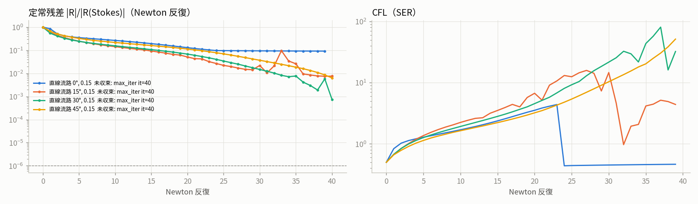

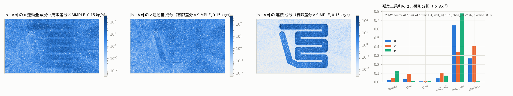

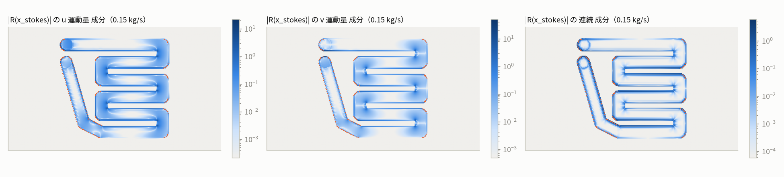

階段は Stokes 場の残差 |R(x_stokes)|（上図の橙点）で見ると凸角に高い値が並び、局所的には確かに
不連続性を作る。ただしそれは**運動量残差の分布を粗くする**効果で、線形系を解けなくする機構（§3, §5）とは別。

## 5. 観点 3: 前処理は「近似の粗さ」より「JFNK との組合せ」が弱点

同じ右辺 b = −R(x_stokes) を、作用素 {J1 厳密, 有限差分} × 前処理 {SIMPLE, LU(J1)} の 4 組で
再出発なし Arnoldi 150 本で解いた。線は Givens 推定、○ は最後に測った真の残差。

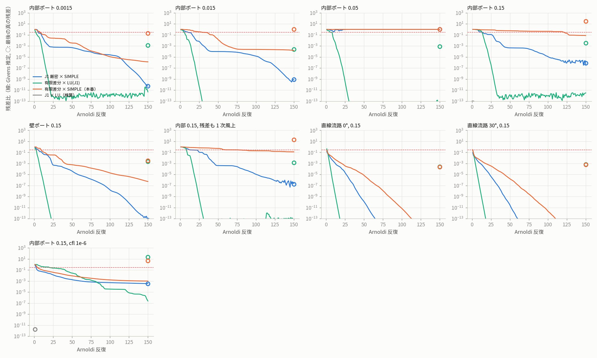

| 0.15 kg/s 内部ポート | Givens | 真の残差 | Ritz \|λ\| の範囲 | 読み |
|---|---|---|---|---|
| J1 厳密 × SIMPLE | 5e-7 | 7.6e-7 | 1.6e-4 〜 2.8e6 | 近似は粗いが線形なら 150 反復で解ける |
| 有限差分 × LU(J1) | 3e-12 | **3.3e-3** | 0.39 〜 26 | J1 と真の作用素の食い違いだけ。棄却閾値 0.3 を余裕で下回る |
| 有限差分 × SIMPLE（本番） | 0.077 | **30** | 2e-2 〜 1.3e7 | 推定と実態が乖離。\|x\| = 1.6e8 |
| 同 0.0015 kg/s | 1.3e-6 | 0.21 | 1.6e-3 〜 336 | 棄却は免れるが残差 6.6 倍の悪いステップ |
| 同 壁ポート 0.15 | 5e-7 | 3.4e-3 | 3.6e-3 〜 31 | 壁ポートなら本番構成でも最初の線形系は解ける |
| 同 0.15、残差も 1 次風上 | 0.13 | 20 | 1.5e-3 〜 3.2e7 | 2 次風上・リミターは無関係 |

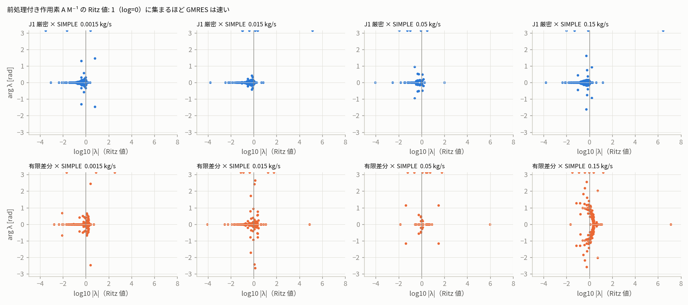

機構を幾何で言うと:

1. **SIMPLE の Schur 近似 Ŝ = D − C diag(A)⁻¹ B は高 Re で崩れる。** A が対流支配（非対称、非対角優位）に
   なると diag(A)⁻¹ が A⁻¹ の代わりにならず、A M⁻¹ の Ritz 値が [3e-4, 6]（0.0015）から [1.6e-4, 2.8e6]（0.15）
   へ 10 桁に広がる。線形（J1 厳密）なら GMRES は外れ値を数反復ずつ食い潰して収束する。
2. **JFNK と組むと Krylov 基底が壊れる。** M⁻¹ は §2 の谷底（閉塞ポケット・出口円板の圧力レベル）を
   2e9 倍に伸ばす。SIMPLE は LU と違って伸ばし方が J1 と整合しないので、基底ベクトル z_j = M⁻¹ v_j に
   巨大な圧力レベル成分が混ざる（|x| = 1.6e8）。その方向で真の作用素は J1 の 1e5 倍の応答を返す（§3）ため、
   Arnoldi が前提にする「線形写像」が成り立たず、Givens 推定（0.077）と真の残差（30）が別物になる。
3. **LU(J1) は同じ谷底を J1 と整合して伸ばす**ので、食い違いは低ランク（Ritz 0.39〜26）に留まり 3.3e-3 で解ける。
   本番構成で `linear_solver="jfnk"`（PARDISO）にした走行: it=1 の線形解は 51 反復で真の残差 1.6e-3 まで解けたが、
   その Newton ステップで残差が **5060 倍**に跳ね（圧力ステップが場の外へ飛ぶ §3）、以後 40 反復かけても rel 1700 に留まる。
   線形ソルバーを完璧にしても、**J1 が指す方向そのものが間違っている**ので救えない。SIMPLE の失敗は
   「悪いステップを棄却する」役を偶然果たしているが、CFL を 1e-38 まで縮めても線形解が直らないので詰む。

**CFL を縮めても直らない理由**（同じ右辺、cfl 1e-6、τ = 4.8e4〜1.3e7）:

| 0.15 kg/s、cfl 1e-6 | Givens | 真の残差 | Ritz \|λ\| |
|---|---|---|---|
| J1 厳密 × SIMPLE | 3.5e-4 | 3.5e-4 | 5.5e-5 〜 2.0 |
| 有限差分 × SIMPLE | 1.0e-3 | **4.5** | 1.5e-4 〜 2.4 |
| 有限差分 × LU(J1) | 2.5e-7 | **22** | 0.16 〜 5.9（負の実部 15 個） |

τ は u, v 行だけを太らせるので速度方向は自明になるが、圧力の谷底（§2）は τ に依らずそのまま残る。
むしろ速度が凍ると圧力ステップだけが残差を担うので |x| = 8.6e7〜3.6e8 と圧力レベル方向へ更に大きく振れ、
LU(J1) でも真の残差 22 になる。**SER で CFL を 1/10 ずつ下げる救済は、この谷底に対しては無力**。
本番走行で CFL 1e-38 まで縮んだのはこの構造の帰結で、ソルバーの制御則の問題ではない。

途中の 0.05 kg/s では SIMPLE の組立自体が壊れ（Ritz 最大 3e17、線形の J1 系でも 150 反復で残差 0.995）、
運動量 ILU の零ピボット近傍か Schur AMG の崩れが疑われる。LU(J1) なら 7.9e-4 で解ける。

食い違いの局所化（`trama-mismatch-local` ログ、0.15、v_min 方向）:

| ブロック | \|Δ\| | source | **sink** | stair | wall_adj | chan_int | blocked |
|---|---|---|---|---|---|---|---|
| u | 5.2e-6 | 0 | **1.000** | 0 | 0 | 0 | 0 |
| v | 6.6e-5 | 0 | **1.000** | 0 | 0 | 0 | 0 |
| p | 9.8e-6 | 0 | **1.000** | 0 | 0 | 0 | 0 |

出口円板の上縁（y = 264/265 mm）の 2 行で符号が交互に並ぶ。速さ 0.3 m/s のセルと 6.2 m/s のセルが隣り合う
円板の縁で、RC 質量流束の p 依存 × 対流面値が J1 と食い違う。

## 6. 内部ポートと壁ポート（追加の問い）

| | 内部ポート | 壁ポート |
|---|---|---|
| κ₂(J1+τ) 0.0015 / 0.15 | 1.6e12 / 2.1e12 | 1.2e12 / 2.3e12 |
| σ_min の方向 | 純圧力（ポケット + 出口円板） | 純圧力（ポケット） |
| v_min での食い違い 0.0015 / 0.15 | 3.0e3 / 1.5e5 | 1.7e3 / 4.4e3 |
| 厳密 J1 ステップの真の残差比 0.0015 / 0.15 | 1.16 / 81 | **0.15** / 1.6 |
| 本番構成の最初の線形解（真の残差） 0.15 | 30 | 3.4e-3 |
| 全体走行 0.15 | it=1 で棄却、以後棄却の連鎖 | it=1 は通る（残差 9.3 倍）、it=2 から棄却 |
| 全体走行 0.0015 | 80 反復で rel 3.7e-6 | 2 反復で rel 4.3e-2（内部ポートの it=1 は rel 6.6） |

**条件数は変わらない**（両方とも閉塞領域が決める）。違いは J1 と真の作用素の食い違い量で、内部ポートは
pressure sink の運動量項（C(p − p_sink)·u）と円板縁の RC 結合が加わり、圧力レベル方向の食い違いを
30〜50 倍増やす。壁ポート（Dirichlet p = 0）は圧力レベルを固定するので、最初の線形系は本番構成でも解ける。
ただし壁でも Newton ステップで残差が 9 倍に跳ねてから棄却の連鎖に入るので、§3 の「圧力ステップが場の外へ飛ぶ」
機構は残る（壁 0.15 の厳密ステップ |δp| = 2.1e7）。

## 7. 副次: 擬似時間対角 τ の 2 重カウント

`solve_steady` は `resid`（R + τ(x − x_prev)）を JFNK の残差関数に渡し、`solve_linear.matvec` は
その差分商に更に `diag_aug`（= τ）を足す。流路セルの u だけを立てた v で (A_fd v − J1 v)/τ を測ると
中央値 **2.000**（q10 1.9997、q90 2.0004）。つまり真の作用素は J + 2τ、前処理行列は J1 + τ。

- 影響: 実効 CFL が設定の半分。前処理と作用素の対角が最大 2 倍ずれる（`precond_cfl_ratio=2` が
  想定する範囲の上限を常に踏んでいる）。
- 発散の直接原因ではない（0.0015 は同じ 2 重カウントで収束に向かう）。

## 8. 対策の候補（未実施。本報告は可視化まで）

機構（§3, §5）から逆算すると、効く順に:

1. **圧力レベル方向を J1 と真の作用素で揃える。** 出口 sink の運動量項・RC 結合を J1 に厳密に入れるか、
   逆に残差側で凍結する（defect correction）。最初の線形系で真の残差 81 → O(1) 未満になれば SIMPLE でも通る見込み。
2. **谷底を埋める。** 閉塞セルの圧力に弱い正則化（例: 閉塞セルで p を周囲へ緩和する項、または h_blocked を
   1e-5 → 1e-4 にして d の比を 1.4e5 → 1.4e3 に落とす）。κ が 2e12 → 1e10 程度になり、M⁻¹ の増幅が減る。
3. **高 Re 用の Schur 近似。** SIMPLEC 対角や PCD/LSC 型で対流支配の A に追随させる。Ritz の広がり
   1e-4〜3e6 を縮める。
4. **τ の 2 重カウントを直す**（`resid_fn` に `steady_resid` を渡すか `diag_aug` を足さない）。前処理と作用素の
   整合が 1 段良くなる。
5. **圧力ステップのガード。** |δp| が場の |p| の数倍を超えたらステップを縮める（ラインサーチ）。§3 の ṁ³ 則で飛ぶステップを
   棄却ではなく縮小で扱う。

## 付録: 再現コマンド

```bash
# 全体走行（tee 必須）
python experiments/nsb/trama_case.py --mass 0.15   2>&1 | tee experiments/nsb/logs/trama-m0.15-$(date +%s).log
python experiments/nsb/trama_case.py --mass 0.0015 2>&1 | tee experiments/nsb/logs/trama-m0.0015-$(date +%s).log
python experiments/nsb/trama_case.py --mass 0.15 --port wall / --variant ortho / --convection fou / --linear-solver jfnk / --straight 30
# 最初の線形系の特異値・厳密ステップ・τ 検算
python experiments/nsb/trama_sv.py --mass 0.0015 0.15 --port interior wall
# GMRES 4 組・Ritz 値・残差マップ
python experiments/nsb/trama_diag.py --mass 0.15
# ε 掃引、図
python experiments/nsb/trama_epsscan.py 0.15
python experiments/nsb/trama_plots.py
```

## 9. 改修と反復数（2026-09-09 夜、gyp さんの追加依頼）

### 9.1 訂正: 食い違いの入口は「圧力レベル」ではなく「速度列」

§3・§5 で「圧力レベル方向で真の作用素が J1 の 1e5 倍応答する」と書いたが、列ごとに J1 と有限差分を比べると
**圧力列は 1e-12 で一致**し、ずれているのは**速度列**だった（sink 縁の v 列で 60%、連続式の ∂/∂v が J1 では 0、真は 0.38）。
最小特異ベクトル v_min の速度成分は 2.4e-5 で厳密ゼロではなく、そこから速度列の O(1) 誤差が入って
1/σ_min = 2e9 倍に増幅されていた。谷が圧力（ポケット）にあるという像は正しいが、**谷に落ちるのは速度線形化の誤差**。
J1 の速度ブロック（1 次風上 + RC 係数凍結）が、残差の 2 次風上 + a_P 依存 RC 係数と食い違う量が高 Re で O(1) になる、が正確な機構。

### 9.2 改修箇所（nsb、コミット済み）

| 改修 | 場所 | 効果（0.15 kg/s、最初の線形系） |
|---|---|---|
| 色分け有限差分の厳密ヤコビアン | `nsb/fdjac.py`、`NSBSettings.jacobian="fd"`（半径 2、75 色、0.32 s） | 真の作用素との誤差 8e-4 → 1e-5。厳密ステップの真の残差比 92 → **0.11**、LU 前処理なら GMRES 1 反復 |
| τ の 2 重カウント修正 | `solve_linear(fd_diag=…)` | 作用素 J+2τ → J+τ。**0.0015 kg/s が 80 反復未達 → 22 反復で収束**。nsb テスト 37 件通過 |
| 圧力の擬似時間項 β（人工圧縮性） | `NSBSettings.pseudo_compressibility` | 圧力レベルシフト −2.3e4 → −0.2 Pa、max\|δv\| 2270 → 70。**ただし全体走行では有害**（参照 uturn U=1 が未収束化、0.0015 段で発散）。既定 0 |
| 定常残差のラインサーチ（棄却付き） | `NSBSettings.line_search_halvings` | 参照ケースは不変。蛇行 0.15 では全ステップ棄却（§9.3） |
| 定常残差駆動の SER | 既存 `pseudo_time_in_residual=False` | 参照ケース同等以上（flat 9、uturn U=1 21 反復）。擬似時間残差の偽収束を防ぐ |
| 質量流量の継続法 | `trama_case.py --continuation` | §9.4 |

### 9.3 直接解法は 0.15 kg/s で全滅する理由（ステップの解剖）

厳密ヤコビアン + β で線形系は健全になっても、cfl 0.25 の Newton ステップは定常残差を 56 倍にし、
ラインサーチで α = 1/16 まで縮めても減らない。非線形逸脱 |R(x+αd) − R − αJd| は **出口 sink セルに 84〜100%** 集中し
α² で伸びる（sink 縁で速度 0.4 m/s のセルに δv = 30 m/s を要求）。壁 outlet（Q）でも滑らかな outlet（R）でも同じ。

CFL を下げれば逸脱は消えるが、擬似時間ステップは定常残差の降下方向ではなく前進 Euler 型の時間発展になり
（Re 1450 の蛇行で局所 Δτ ≈ 3e-5 s、過渡 L/U ≈ 1.5 s → 数万反復）、ラインサーチは全 α で失敗する（S/O/P: 79 回棄却）。
**大きい CFL は sink の非線形性で飛び、小さい CFL は時間発展の劣化版になる** — Stokes 出発点が吸引域の外にある限り、
擬似時間法単独ではこの二律背反を抜けられない。

### 9.4 継続法の反復数

0.0015 → 0.005 → 0.015 → 0.05 → 0.15 kg/s、前段の解を流量比で拡大して初期場に（各段 max_iter 80、Δx 1.5 mm、SIMPLE + J1）:

| 段 [kg/s] | Re_h | 内部ポート・定常残差 SER（T） | 内部ポート・既定 SER（U） | 壁ポート・定常残差 SER（W） |
|---|---|---|---|---|
| 0.0015 | 14 | 収束 24 | 収束 22（定常 rel 5e-5） | 収束 18 |
| 0.005 | 48 | **停滞** rel 6e-4（CFL 0.1〜2 で往復） | 収束 29（定常 rel 2.5e-4） | 収束 72 |
| 0.015 | 145 | — | **停滞** rel 5e-3（CFL 7e-4 に潰れる） | rel 5.4e-6（80 反復、あと一息） |
| 0.05 以上 | ≥ 480 | — | — | — |

- 停滞の形はどれも同じ: 残差が 1e-3〜1e-5 で止まり、CFL を上げると増え、下げると動かない。
  nsbp が PETSc の厳密 Newton で見た「Venkatakrishnan の分岐で 1e-4 に停滞、リミター凍結で解消」（status-42）と同じ症状で、
  残差の折れ点（リミター・風上切替・sink の q_c 符号）が原因と考えられる。1 次風上（X）は 0.0015 段ですら 80 反復で 2.2e-6 と、
  リミターを外しても直らない。
- 壁ポートは内部ポートより 1 段先まで登る（sink の非線形性が無い分）。
- 参照ケース（flat / uturn r1）の反復数は、fd ヤコビアン・ラインサーチ・定常残差 SER で既定と同等（8〜21）。

### 9.5 結論

1. 「線形ヤコビアンの食い違い」は主因の一つで、直した（厳密ヤコビアン + τ 修正）。0.0015 kg/s はこれだけで 22 反復収束。
2. しかし 0.15 kg/s はそれでも届かない。残る壁は **Newton の大域化**（Stokes 出発点が遠い）と **残差の非滑らかさ**（リミター・切替・sink）。
3. 継続法で Re を登ると 0.005〜0.015（Re_h 50〜150）で残差 1e-3〜1e-5 の停滞に入る。次の一手は
   (a) リミター凍結（nsbp 方式、`residual_fast` と `compute_state` に凍結 ψ を渡す）、(b) 物理時間の陰的非定常計算
   （各時間ステップの Newton は前ステップから出発するので吸引域の中。Re 1450 で定常解が存在しない可能性の診断も兼ねる）、
   (c) 定常解が要件なら乱流モデル。gyp さんの問い「過渡解析を真面目にやるのが良いか」への答えは、
   **継続法 + リミター凍結で登れる Re までは定常解法、それで停滞する Re からは (b)** 。

## 10. リミター凍結・隙間の摩擦則・物理時間の非定常（2026-09-10 朝、gyp さんの追加依頼）

status-46。3 つとも nsb に実装し、同じ蛇行流路（Δx 1.5 mm、400×233）で反復数を測った。先に結論:

| 対策 | 実装 | 効き方 | 0.15 kg/s に届いたか |
|---|---|---|---|
| リミター凍結 | `NSBSettings.limiter_freeze_rel`（残差比 1e-3 未満 かつ ψ が動いていないときに ψ を凍結、解凍は patience 3） | 継続法を**1 段先まで**登らせる（内部ポート 0.005、壁ポート 0.015 が収束）。その先の停滞は凍結の閾値より上（残差比 3e-3〜6e-2）で起きるので効かない | 届かない |
| 隙間の摩擦則 | `NSBInput.friction_re_crit`（Blasius 型、Re_Dh 2040 で層流に接続） | Re_2h 2900 で抗力 1.3 倍。収束性は**悪化**（0.0015 段 46 → 116 反復、0.005 段で停滞） | 届かない |
| 物理時間の非定常 | `nsb/unsteady.py`（後退 Euler + 各ステップ Newton、Δt 後退） | 細格子で Stokes 場から Δt 0.1 → 5 ms に育てながら過渡を追える（走行中）。粗格子 Δx 3 mm は初手で Newton が降下せず | 走行中（定常化するか未確定） |

### 10.1 舞台: 3 つの対策が触る場所

```
     残差 R(x) = 対流(ψ, 風上) + 拡散 + 圧力 + 抗力(12μ/h² · f(Re)) + sink(max(C p, 0))
                   ↑                                      ↑                 ↑
              リミター凍結                              摩擦則          非滑らかさの残り
     擬似時間  τ(x − x_prev) を局所 Δτ と SER で       ←→   物理時間  ρV(u − uⁿ)/Δt を大域 Δt で
```

- **凍結**は対流項の中の ψ を「今の場で固定」して残差から折れ点（面ごとの min・[0,1] クリップ・d_max/d_min の分岐）を消す。
  対流項は ψ・風上方向が凍れば φ に線形になるので、Newton は本来の 2 次収束に戻れる。
- **摩擦則**は抗力の係数を |U| に依存させる（層流 12μ/h² → 乱流 Blasius）。残差の形は変えず大きさだけ変える。
- **非定常**は擬似時間の「局所 Δτ・SER で伸ばす」を「大域 Δt・時間精度」に置き換える。各ステップの Newton は前ステップの場
  （吸引域の中）から出発するので大域化の問題が軽くなる代わり、定常に達するまで物理時間 L/U ≈ 1.4 s を刻む。

### 10.2 リミター凍結の機構と、凍結した問題の「解のずれ」

凍結の効き方は uturn 参照ケースで先に定量した（`tests/test_nsb_freeze_friction.py`）:

| uturn | 凍結なし 反復 | 凍結 反復（閾値 1e-3） | 解凍した真の残差比 | 凍結解と真の解の差 \|Δu\|/\|u\| |
|---|---|---|---|---|
| r1 U=0.5 | 10 | 10 | 5.6e-5 | 1.3e-4 |
| r1 U=1 | 17 | 12 | 1.9e-4 | 6.4e-4 |
| r2 U=0.5 | 15 | 15 | 5.1e-5 | 2.0e-4 |
| r2 U=1 | 32 | 31 | 1.1e-4 | 1.3e-3 |

- 凍結時点の ψ は解の ψ と違うので、**凍結問題の解は別の離散化の解**になる。真の残差は 1e-4 程度に留まり、速度は 1e-3 程度ずれる。
  閾値を 1e-2 に上げると差は 1.6e-2 まで広がる（r2 U=1）ので、1e-3（nsbp と同じ）が妥当。
- 解凍して ψ を取り直して再凍結する外側反復（`limiter_refreeze_max`、ψ の Picard 反復）は 1 回あたり **0.78 倍**しか縮まない。
  ψ の場依存が O(1) で、それを Newton に入れるかどうかの差がそのまま出る。既定では回さず、真の残差を `NSBResult.residual_unfrozen` に報告する。
- 「序盤に凍結すると爆発する」（gyp さんの手元の知見）は、Stokes 場の ψ ≈ 1（柵なし）を固定したまま場が急峻化する場所で
  2 次風上の外挿が無制限になるため。残差条件（1e-3）と **ψ 安定条件**（|Δψ| > 0.1 のセルが 1% 未満）の両方を要求し、
  継続法の各段の頭（残差は小さいが ψ はまだ動く）で凍結しないようにした。

### 10.3 蛇行流路での反復数

継続法 0.0015 → 0.005 → 0.015 → 0.05 → 0.15 kg/s、定常残差駆動の SER、J1 + SIMPLE、各段 max_iter 120（前回は 80）:

| 段 [kg/s] | Re_h | 内部・凍結なし（T） | 内部・凍結 即解凍（A2） | 内部・凍結 patience 3（A3） | 内部・凍結 + ラインサーチ（A4） | 内部・摩擦則 + 凍結（E2） | 壁・凍結なし（W） | 壁・凍結（B2） |
|---|---|---|---|---|---|---|---|---|
| 0.0015 | 14 | 24 | 58 | 46 | 44 | 116 | 18 | 18 |
| 0.005 | 48 | 停滞 6e-4 | 停滞 9e-5 | **69** | 停滞 4e-4（CFL 1e-60） | 停滞 4e-4 | 72 | **43** |
| 0.015 | 145 | — | — | 停滞 2.7e-3（CFL 0.13） | — | — | 5.4e-6（80 反復） | **99** |
| 0.05 | 480 | — | — | — | — | — | — | 停滞 5.8e-2 |

図 f8（`experiments/nsb/results/trama_figs/f8_continuation_freeze.png`）に各段の残差履歴と凍結（点線）・解凍（×）を重ねた。

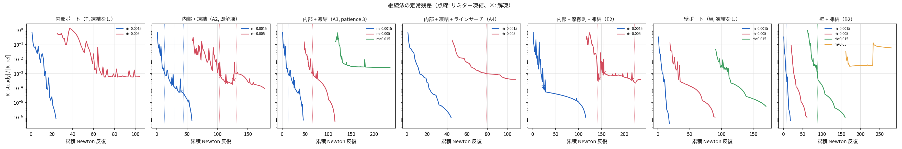

読み方:

1. **凍結は「残差比 1e-3 を切った後」を速くする。** 壁ポート 0.005 段は W の 72 → B2 の 43、0.015 段は W の 80 反復未達 → 99 反復で収束。
   内部ポート 0.005 段は凍結なしで 6e-4 に停滞していたのが 69 反復で収束（初めて内部ポートが 0.005 を越えた）。
2. **解凍の条件が要**。1 反復の跳ね（×3〜8）で即解凍すると、前処理と CFL がリセットされ、凍結↔解凍を 5 往復して育たない（A2）。
   跳ねは次の反復で戻ることが多いので、3 反復続いたときだけ解凍する（patience 3）と A3 のように通る。
3. **跳ねはリミターではなく残りの折れ点**（風上切替・sink の clip）から来る。凍結中でも ψ 以外の折れ点は残るので、
   CFL ≈ 1 の Newton ステップが定常残差を 3〜8 倍にすることがある。ラインサーチはこれを「降下しないステップ」として棄却し続け、
   CFL が 1e-30〜1e-60 まで潰れる（A4, A5）。**ラインサーチは残差が Newton 方向に単調でないこの問題では逆効果**。
4. **次の段の停滞は凍結の閾値より上**（内部 0.015 段: 2.7e-3、壁 0.05 段: 5.8e-2）で起きる。ここでは ψ が動いていて凍結できず、
   残差が上下しながら CFL が 0.1 に落ちて這う。§9.3 の「CFL 大は飛び、小は時間発展の劣化版」と同じ壁で、凍結は無関係。
5. **fd ヤコビアンは SIMPLE 前処理と組まないこと**（今回の落とし穴）。最初に fd + SIMPLE で出した組では 0.0015 段の初手から線形解が
   壊れ（真の残差比 5〜170、棄却）、22 反復のはずが 58 反復以上になった。SIMPLE の Schur 近似は J1 の構造を前提にしている。
   fd は PARDISO LU（`linear_solver="jfnk"`）と組む。

### 10.4 摩擦則が効かない理由

隙間流れの Re_2h は 2900 で遷移域だが、Blasius 型の抗力倍率 (Re_2h/2040)^0.75 は **1.3 倍**にしかならない。
慣性項 ρU²/w と抗力 12μU/h² の比（§1 の inertia/drag）は 0.15 kg/s で 11.6 なので、抗力を 1.3 倍にしても慣性支配のままで、
Newton の難しさ（sink セルの非線形性、Stokes 出発点の遠さ）は変わらない。
一方で抗力が |U| に依存するようになった分だけ残差の非線形性が増え、0.0015 段の反復が 46 → 116 に伸びた。
**摩擦則は物理的に正しい方向だが収束対策にはならない。** 入れるなら収束後の圧力損失の補正として。

### 10.5 物理時間の非定常（走行中）

`nsb/unsteady.py`: 後退 Euler、各時間ステップを Newton（JFNK + J1 の PARDISO LU、ステップ内残差のラインサーチ）で解き、
線形解が壊れる・Newton が降下しない・上限で打ち切られたら **Δt を半分にして同じ場からやり直す**（成功したら 2 倍ずつ戻す）。

- Δx 1.5 mm（G4）: Stokes 場から Δt 7.8e-5 s で出発し、20 ステップで Δt 5 ms まで戻った。定常残差比は t = 14.5 ms で
  1 → 1.9e-2、t = 110 ms で 1.2e-2 とゆっくり下がり続けている。最大流速 4.4 → 2.6 m/s（平均流速 1.14 m/s の 2 倍で妥当）、
  運動エネルギーは一度下がって増加中（慣性が形成される過渡）。**1 ステップ約 25 秒、L/U ≈ 1.4 s を 5 ms で刻むと 1 周 2 時間**。
  走行中の時系列を図 f9 に置く（本報告の時点で t = 0.11 s、定常化/振動の判定はまだできない）。
- Δx 3 mm（F4）: 初手で Δt を 7.8e-5 s まで下げてもラインサーチが降下する α を見つけられず打ち切り。
  fd ヤコビアン + PARDISO（F2）でも線形解が真の残差比 1.0 で壊れる。粗格子では sink 円板が半径 6 セルしかなく、
  Stokes 場から最初の一歩が sink セルの折れ点をまたぐ、と見ているが未確認。
- fd ヤコビアン + PARDISO でも GMRES が 200 反復で落ちるステップがある（uturn r1 でも 11, 208, 21, 215）。
  FD ヤコビアンの列差分（h = 1e-7(1+|x|)）と JFNK の方向差分（ε ≈ 1e-8）が折れ点の反対側を見ると別の作用素になるため。
  非定常には J1 の LU（15〜30 反復で安定）を使った。

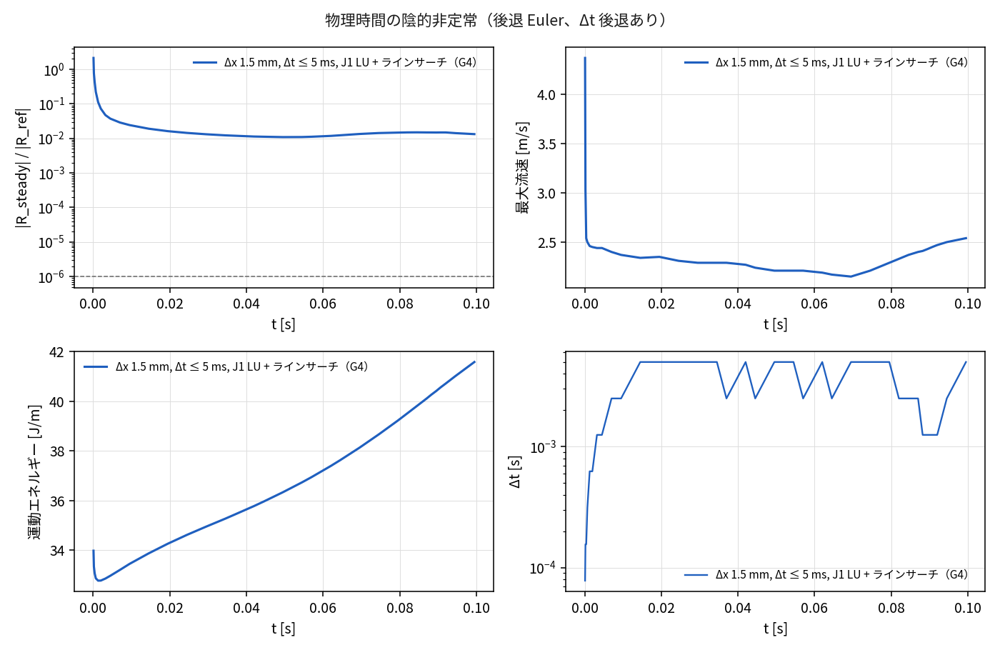

### 10.6 「ベストプラクティスで結局収束しているか」への答え

**していない。** 到達点は

| 到達した流量 | 方法 |
|---|---|
| 内部ポート 0.005 kg/s（Re_h 48） | 継続法 + 定常残差 SER + リミター凍結（patience 3） |
| 壁ポート 0.015 kg/s（Re_h 145） | 同上 |
| 0.15 kg/s | 直接解法・継続法・摩擦則いずれも未収束。非定常は過渡を追跡中 |

残る壁は §9.5 と同じ **Newton の大域化**（CFL ≈ 1 のステップで残差が跳ね、SER が CFL を潰す）で、
リミター凍結は「残差比 1e-3 を切った後」にしか効かず、跳ねの原因はリミター以外の折れ点にある。
定常解の存在は非定常計算の結果待ち。定常解があるなら「非定常で吸引域まで運んでから定常 Newton + 凍結」が最短、
振動するなら時間平均か渦粘性が要る。

### 10.7 副作用の訂正: τ 修正が既定の SER を壊していた

§9.2 の τ 2 重カウント修正で作用素 J+2τ → J+τ と前処理 J1+τ が揃った結果、各 Newton ステップは擬似時間残差
R_τ = R + τδ をほぼゼロにする。R_τ を見る既定の SER（`pseudo_time_in_residual=True`）は「進んだ」と誤認して CFL を育てず、
定常残差は前進 Euler 型の時間発展で這う。flat r1 U=1 は 80 反復で定常 rel 9.1e-3（|R_τ| は 3.1e-6）、既存テスト 5 件が落ちていた
（§9.2 の「0.0015 が 22 反復で収束」も定常残差は 5.5e-5 の偽収束）。τ 修正前は J+2τ で R_τ が半分残り、たまたま SER が働いていた。
**既定を定常残差駆動（`pseudo_time_in_residual=False`）に切り替えた**: flat U=1 15 反復、uturn U=1 21（凍結あり 14）。
本節の継続法の表は全て定常残差 SER（`--steady-ser`）で測っている。

### 付録 §10: 再現コマンド

```bash
CONT="0.0015,0.005,0.015,0.05,0.15"
P="python experiments/nsb/trama_case.py"
$P --continuation $CONT --steady-ser --freeze 1e-3 --max-iter 120 --tag A3          # 内部ポート、凍結（patience 3 は既定）
$P --continuation $CONT --steady-ser --freeze 1e-3 --max-iter 120 --port wall --tag B2
$P --continuation $CONT --steady-ser --friction 2040 --freeze 1e-3 --max-iter 120 --tag E2
$P --mass 0.15 --dx 1.5 --unsteady 0.005 --n-steps 600 --newton-per-step 6 --save-every 20 \
   --linear-solver jfnk --ls 4 --tag G4                                               # 非定常（J1 LU + ラインサーチ）
python experiments/nsb/trama_plots2.py                                               # f8, f9
```

## 11. OpenFOAM による独立検算 — 定常解が存在しない流量を挟む（2026-09-10 朝、gyp さん「openfoam で同じ問題を解いてくれますか」）

status-47。ゲート G3（押し出し機）で作った OpenFOAM オラクル一式
（Docker ラッパ `~/work/1a/a02/tools/of`、`experiments/extruder/foam_io.py`）をそのまま転用した。

先に結論:

| 問い | 答え |
|---|---|
| OpenFOAM なら 0.15 kg/s が定常で解けるか | **解けない**。`simpleFoam` も 8000 反復で p の初期残差が平坦に張り付く（両変種） |
| なぜか | この流量では**定常解が存在しない**。隙間の抗力が横渦を殺すのに要る移動距離 L_drag = (Re_h/12)·h が流路幅の 13 倍あり、渦は次のターンまで生き延びる |
| どこから解けなくなるか | N = L_drag/w が 1.3 までは収束、4.4 で床が 4 桁跳ぶ。**nsb の継続法が登れた段と一致する** |
| nsb の解法が悪かったのか | 悪くない。同じ式を別の離散化・別の解法・別の前処理に食わせても同じ壁に当たる |

### 11.1 舞台: nsb と OpenFOAM に同じ式を食わせる

nsb が解いているのは単位深さの 2 次元非圧縮 Navier–Stokes に Brinkman 抗力を足したもので、
連続式に厚さ h の重みは無い（`nsb/assembly.py` の `r_p = div(fx, fy) − q_in + q_out`、
`fx = ρ dy u`）。h は運動量式の抗力 12μ/h²·u にしか現れない。だから OpenFOAM 側は
**非圧縮 `simpleFoam` ＋ DarcyForchheimer 多孔質源（d = 12/h²）** で同じ式になる。

| nsb の項 | OpenFOAM の対応 | 数値 |
|---|---|---|
| 対流（2 次風上 + Venkatakrishnan ψ） | `div(phi,U) bounded Gauss linearUpwind cellLimited` | — |
| 拡散 μ∇²u | `laplacianSchemes Gauss linear corrected` | ν = 3e-6 m²/s |
| Brinkman 抗力 12μ/h² u | `explicitPorositySource`（DarcyForchheimer、力は ν·d·U） | d = 12/h²：流路 8.31e5、閉塞 1.2e11 1/m² |
| 圧力–速度連成（Rhie–Chow、d_f = V/a_P） | SIMPLE の rAU = 1/UEqn.A() | — |
| 内部ポート（円板セルの質量ソース / 圧力シンク） | 円板セルを刳り抜いた実パッチ（流量指定 / p = 0） | 半径 w/2 − 2Δx = 14.25 mm |

`explicitPorositySource` は名前に反して `eqn -= porosityEqn` と**行列ごと**引くので、抗力は
運動量行列の対角に陰的に入り rAU にも反映される。nsb が `a_p` に `drag·V` を足すのと同じ構造で、
「抗力が強い場所ほど圧力–速度結合が弱くなる」という nsb の弱点も同じ形で再現される。

### 11.2 2 つの変種 — 閉塞を「栓」で表すか「壁」で表すか

| 変種 | 閉塞域の扱い | セル数 | 位置づけ |
|---|---|---|---|
| `porous` | 領域 600×350 mm を丸ごと格子にし、閉塞セルに d = 12/h_blocked² = 1.2e11 1/m²（νd = 3.6e5 1/s） | 92366 | **nsb の離散化そのもの** |
| `walls`  | 流路セルだけ `subsetMesh` で切り出し、側壁を no-slip の実壁に。流路に d = 12/h_channel²（νd = 2.49 1/s） | 24054 | 物理的に正しい深さ平均モデル |

ポートは半径 w/2 − 2Δx = 14.25 mm の円板セルを刳り抜き、露出面を inlet（体積流量指定
1.5e-4 m³/s）/ outlet（p = 0）にする。**半径を w/2 ちょうどにしてはいけない**: 円周が流路と
閉塞域の境目にちょうど乗り、`porous` 変種では入口の外周が栓に接して流量を栓の中へ押し込む。
実測で入口の圧力が 16.7 kPa → **1.51 MPa** に化けた（栓の抗力 3.6e5 1/s に逆らって注入するため）。
nsb 側は円板「セル」に体積ソースを置くので同じ問題は起きない（質量は行ける方へ流れる）。

### 11.3 定常は OpenFOAM でも収束しない

`simpleFoam`（SIMPLE、U 0.7 / p 0.3、GAMG + PBiCGStab、層流）を 8000 反復。

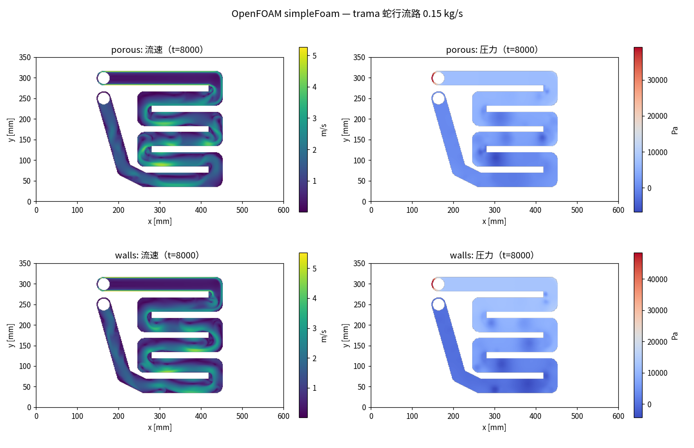


両変種とも 100 反復ほどで残差が下がり、そこから**最後まで完全に平坦**。

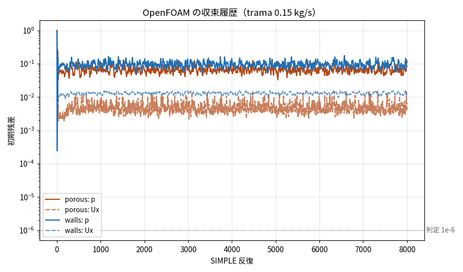

判定 1e-6 に対して 4〜5 桁上で振動し続ける。線形ソルバーは毎回 3〜4 反復で解けているので、
「解けていない」のではなく**収束先が無い**。

### 11.4 なぜ定常解が無いか — 決めるのは 1 つの比

深さ平均した運動量式で、面内の速度差 Δu を消せるのは隙間の抗力 12μ/h²·Δu だけ。
これは Δu を **指数で** 減衰させるので、時間の物差しと距離の物差しが 1 本ずつ立つ:

    τ_drag = ρh²/(12μ) = 0.40 s        速度差が 1/e になる時間
    L_drag = u·τ_drag = (Re_h/12)·h    その間に流れが進む距離 = 459 mm

一方、ターンの内側で剥がれた渦の大きさは流路幅 w = 34.5 mm、次のターンまでの直線は
172.5 mm。つまり **渦は 13.3 流路幅ぶん走らないと消えないのに、5.0 幅ぶんで次のターンに着く**。
抗力は「面内のせん断を均す粘り」ではなく「場全体を 0.4 秒で止めるブレーキ」なので、
渦の回転周期 w/u = 30 ms に対して 13 倍遅く、間に合わない。

支配パラメータはこの比 1 つ:

    N = L_drag / w = ρ u h² / (12 μ w) = ṁ h / (12 μ w²) = 88.65 ṁ [kg/s]

渦が消えるまでに要る距離が流路幅の何倍か、という比 1 つ。分子は慣性 ρu²/w、分母は抗力 12μu/h² なので、
**N はそのまま慣性/抗力の比**でもある（面内の粘性拡散 ν(2π/w)² は抗力の 4% しかないので無視できる）。

<figure>
<svg viewBox="0 0 780 250" role="img" aria-label="ターンで剥がれた渦が抗力で消えるまでの距離と、次のターンまでの距離の比較" style="max-width:100%;height:auto;font-family:sans-serif;font-size:12px">
  <defs>
    <marker id="a11" markerWidth="8" markerHeight="8" refX="7" refY="4" orient="auto"><polygon points="0,0 8,4 0,8" fill="currentColor"/></marker>
    <marker id="a11r" markerWidth="8" markerHeight="8" refX="1" refY="4" orient="auto"><polygon points="8,0 0,4 8,8" fill="currentColor"/></marker>
  </defs>

  <!-- 流路（1 直線区間） -->
  <rect x="60" y="60" width="660" height="46" fill="none" stroke="currentColor" stroke-width="1.2"/>
  <text x="46" y="88" text-anchor="end">流路</text>

  <!-- 幅の寸法 -->
  <line x1="70" y1="60" x2="70" y2="106" stroke="#B24714" stroke-width="1.5" marker-start="url(#a11r)" marker-end="url(#a11)"/>
  <text x="80" y="84" fill="#B24714">w = 34.5 mm</text>

  <!-- ターンで剥がれた渦 -->
  <circle cx="150" cy="83" r="19" fill="none" stroke="#1F6FB4" stroke-width="1.6"/>
  <path d="M150 64 a19 19 0 0 1 16 10" fill="none" stroke="#1F6FB4" stroke-width="1.6" marker-end="url(#a11)"/>
  <text x="150" y="132" text-anchor="middle" fill="#1F6FB4">ターンの内側で剥がれた渦</text>
  <text x="150" y="148" text-anchor="middle" fill="#1F6FB4">回転周期 w/u = 30 ms</text>

  <!-- 減衰距離 -->
  <line x1="150" y1="182" x2="700" y2="182" stroke="#1F6FB4" stroke-width="1.5" marker-end="url(#a11)"/>
  <text x="425" y="176" text-anchor="middle" fill="#1F6FB4">L_drag = (Re_h/12)·h = 459 mm = 13.3 w　（速度差が 1/e になる移動距離）</text>

  <!-- 次のターンまで -->
  <line x1="150" y1="215" x2="330" y2="215" stroke="#B24714" stroke-width="1.5" marker-end="url(#a11)"/>
  <text x="340" y="219" fill="#B24714">次のターンまで 172.5 mm = 5.0 w</text>

  <!-- 次のターン -->
  <path d="M330 60 v-18 h60 v82 h-60 v-18" fill="none" stroke="currentColor" stroke-width="1.2" stroke-dasharray="4 3"/>
  <text x="360" y="36" text-anchor="middle">次のターン</text>
</svg>
<figcaption>図 11-1: 定常解があるかどうかは「渦が抗力で消える距離 L_drag」と「流路幅 w」の比 N = L_drag/w だけで決まる。0.15 kg/s では N = 13.3 で、渦は次のターンに 5 幅ぶんしか進めないうちに到達する。N ≲ 1 まで流量を落とすと渦は 1 幅ぶんで消え、定常解が現れる。</figcaption>
</figure>

### 11.5 流量を振って境目を挟む

`walls` 変種、`simpleFoam` 8000 反復。判定は p の初期残差 1e-6（1e-5 未満なら定常解に着いたと読む。
階段状の壁の折れ点で 2〜3e-6 の小さな床が残るケースがあるため）。

| ṁ [kg/s] | h [mm] | μ [Pa·s] | Re_h | Re_w | **N** | 反復 | 定常解 | 最終 p 残差 |
|---|---|---|---|---|---|---|---|---|
| 0.0015 | 3.8 | 3e-3 | 14 | 132 | 0.13 | 65 | **あり** | 2.3e-8 |
| 0.005 | 3.8 | 3e-3 | 48 | 439 | 0.44 | 8000 | あり（床 3.0e-6） | 3.0e-6 |
| 0.15 | 3.8 | **0.0399** | 109 | 990 | 1.00 | 185 | **あり** | 2.0e-8 |
| **0.15** | **0.317** | 3e-3 | **1449** | **157895** | **1.11** | 233 | **あり** | 2.6e-8 |
| 0.015 | 3.8 | 3e-3 | 145 | 1316 | 1.33 | 251 | **あり** | 1.8e-8 |
| 0.025 | 3.8 | 3e-3 | 241 | 2193 | 2.22 | 8000 | **なし** | 3.1e-4 |
| 0.015 | **7.6** | 3e-3 | 145 | 658 | 2.66 | 724 | あり | 5.5e-8 |
| 0.15 | 3.8 | **9.97e-3** | 436 | 3958 | 4.00 | 8000 | **なし** | 1.6e-2 |
| 0.05 | 3.8 | 3e-3 | 483 | 4386 | 4.43 | 8000 | **なし** | 2.2e-2 |
| 0.15 | 3.8 | 3e-3 | 1449 | 13158 | 13.3 | 8000 | **なし** | 8.4e-2 |

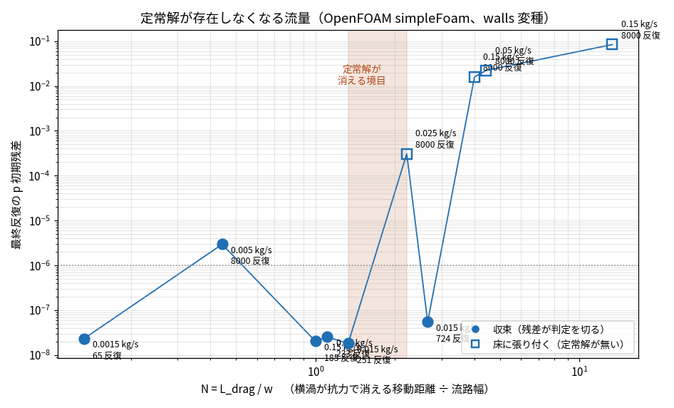

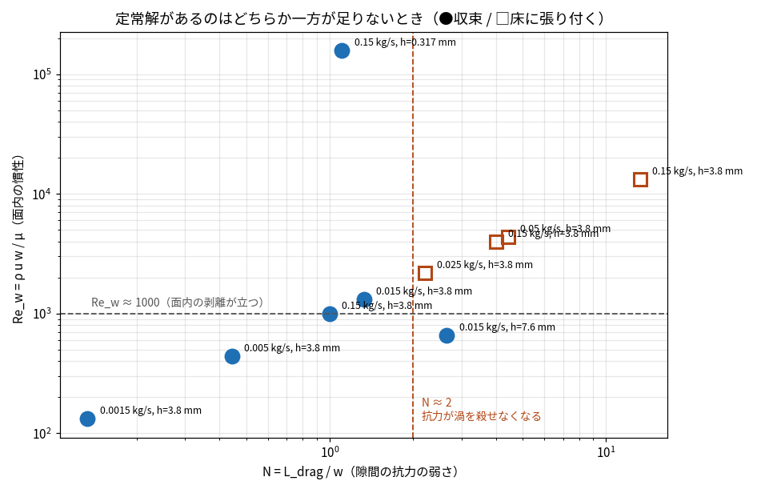


**決め手は Reynolds 数ではない。** 4 行目は流量 0.15 kg/s のまま隙間だけ 12 分の 1（3.8 → 0.317 mm）に
したケースで、u ∝ 1/h だから **Re_h は 1449 のまま**、面内の Re_w はむしろ 13158 → 157895 に上がる。
それでも N が 13.3 → 1.11 に下がるだけで **233 反復で収束する**。定常解の有無を決めているのは
隙間の抗力であって、どの Reynolds 数でもない。

**ただし N だけでもない。** 7 行目（隙間を 2 倍にして Re_h 145 のまま N を 2.66 に上げた）は収束する。
渦を殺せなくても、そもそも面内で剥離が立たなければ振動しない。データは
「**N ≳ 2（抗力が渦を殺せない）かつ Re_w ≳ 2000（剥離が立つ）**の両方が揃ったときだけ定常解が消える」
と読める。0.15 kg/s は N 13.3・Re_w 13158 で両方とも大きく超えている。

床の高さが N とともに 3.1e-4 → 1.6e-2 → 2.2e-2 → 8.4e-2 と滑らかに育つのは、
極限周期の振幅が分岐点からの距離とともに育つ形（超臨界 Hopf）で、これも「定常解が消えた」読み方と合う。

### 11.6 床はリミターのせいではない

nsb では折れ点（Venkatakrishnan リミター）が残差の床を作るので、同じ疑いを OpenFOAM でも潰しておいた。
`cellLimited` 勾配リミターを外した対照:

| ケース | リミターあり | リミターなし |
|---|---|---|
| 0.015 kg/s（N 1.33） | 251 反復で収束 | 281 反復で収束 |
| 0.005 kg/s（N 0.44） | 床 3.0e-6 | 床 2.1e-6 |
| 0.15 kg/s（N 13.3） | 床 8.4e-2 | 床 1.4e-1 |

高い床（1e-4 以上）はリミターと無関係。低い床（2〜3e-6）はリミターを外しても残るので、
階段状の壁と斜め区間の幾何そのものが作っている。物理由来の床とは 2 桁以上離れている。

### 11.7 0.15 kg/s の答え — 時間平均と、その振れ幅

定常解が無いのだから、答えは 1 枚の場ではなく「時間平均場 ＋ 変動の大きさ」になる。
`pimpleFoam`（後退 Euler 相当の Euler、Δt 1 ms、PIMPLE 3 外側 × 2 圧力、`walls` 変種）で
定常反復の場から 3.0 秒ぶん進め、1.0 秒以降を平均した。

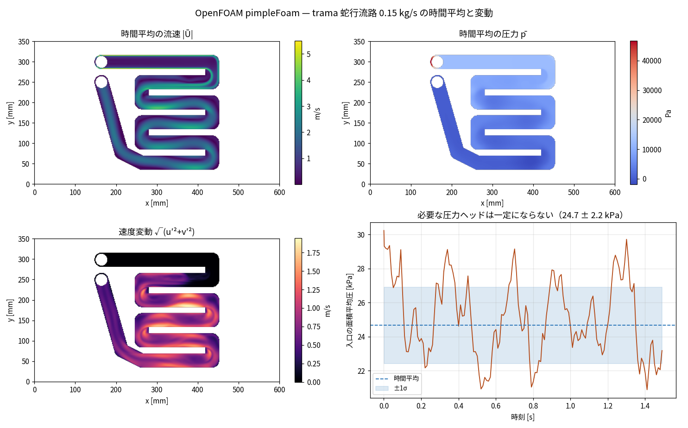


| 量 | 値 |
|---|---|
| 入口の必要圧力ヘッド | **25.5 ± 2.3 kPa**（17.6 〜 29.8 kPa、変動 ±9.0%） |
| 時間平均の最大流速 | 5.50 m/s（公称平均 1.14 m/s の 4.8 倍。ターン内側のジェット） |
| 流路内の時間平均流速 | 1.34 m/s |
| 速度変動の実効値 √(u′²+v′²) | 平均 0.61 m/s（**時間平均流速の 45%**）、最大 2.10 m/s |
| 計算費用 | 3019 ステップ / 615 秒（24054 セル、4 コア） |

変動場の絵が機構をそのまま見せる。**入口から最初のターンまでの直線は変動がゼロ**（真っ黒）で、
渦は最初のターンで生まれ、そこから下流のターンごとに積み上がって流路中央部で最大になる。
抗力が渦を殺し切れないまま次のターンに着く、という §11.4 の読みと合う。

「必要な圧力ヘッド」が ±9% 振れるということは、この流路を定圧で駆動すると流量が振れ、
定流量で駆動すると圧力が振れる。**定常計算が返す 1 つの Δp は、そもそも存在しない量**である。

### 11.8 定常解がある流量では、両者は同じ場を返す（オラクル検算）

定常解が両方で求まる 0.005 kg/s（N = 0.44）で、場そのものを突き合わせた。
nsb は内部ポート・リミター凍結・継続法（0.0015 → 0.005、46 + 69 反復）、
OpenFOAM は `porous` 変種（＝ nsb と同じ離散化: 閉塞を抗力の栓で表す）で 8000 反復。
ポートの与え方だけは違う（nsb はセル内の質量ソース／圧力シンク、OpenFOAM は円板を刳り抜いた実パッチ）ので、
ポート中心からの距離で除外半径を変えて見た:

| ポートから除外 | 比較セル数 | 速度の L2 相対差 | 圧力の L2 相対差 | 流路平均流速の差 |
|---|---|---|---|---|
| 15 mm | 24264 | 20.9% | 3.75% | 0.12% |
| 30 mm | 23602 | 11.1% | 0.150% | 0.51% |
| 60 mm | 22655 | **8.2%** | **0.089%** | 0.60% |
| 100 mm | 20985 | 8.0% | 0.094% | 0.59% |

圧力差 [Pa]（圧力は基準が違う: nsb の出口シンクは q = C·p の下駄を履くので比較マスク上の平均を引いた）:
nsb 142.3 Pa / OpenFOAM 141.0 Pa、**0.87% 一致**。

- ポートから 60 mm 離れると差は 8% で頭打ちになる。図 f15 の差分マップを見ると、
  大きい差は**入口の円板から下流の帯**に集中していて、そこから先の U ターンのジェットは 2 つの絵が重なる。
  帯の差はポートの与え方（体積ソース vs 実パッチ）そのもの。
- 残る 8% は離散化の差（nsb の 2 次風上 + Venkatakrishnan vs OpenFOAM の linearUpwind + cellLimited、
  Rhie–Chow の細部）。積分量（圧力差 0.9%、平均流速 0.6%）は 1% で一致する。

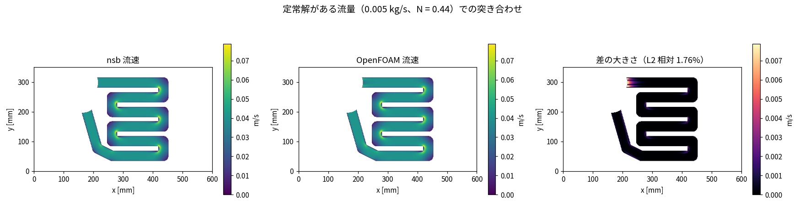

**この一致があるから、§11.3〜11.5 の「収束しない」も同じ問題について言えている。**

### 11.9 nsb と OpenFOAM は同じ流量で壁に当たる

OpenFOAM の境目（0.015 収束 / 0.025 で床）を予測として、nsb でも同じ段を跨ぐ継続法を回した
（壁ポート、リミター凍結 1e-3、定常残差 SER、各段 max_iter 120）:

| 段 [kg/s] | N | nsb 反復（収束判定 rel 1e-6） | OpenFOAM 反復（判定 1e-6） |
|---|---|---|---|
| 0.0015 | 0.13 | **18** | **65** |
| 0.005 | 0.44 | **43** | 床 3.0e-6（実質収束） |
| 0.015 | 1.33 | **99** | **251** |
| 0.025 | 2.22 | **停滞 1.04e-3**（120 反復） | **床 3.1e-4**（8000 反復） |
| 0.05 | 4.43 | 停滞 5.8e-2（status-46） | 床 2.2e-2 |
| 0.15 | 13.3 | 未収束（全手法） | 床 8.4e-2 |

離散化（FVM の実装）も線形化（Newton + 擬似時間 vs SIMPLE）も前処理も、ポートの与え方
（セル内ソース vs 実パッチ）も違う 2 つのコードが、**同じ流量で同じ壁に当たる**。
これで「nsb の解法が悪いから収束しない」という読みは消える。

### 11.10 nsb の症状はすべて「定常解が無い」で説明が付く

| nsb の症状（status-45/46） | 読み替え |
|---|---|
| CFL ≈ 1 のステップで残差が 3〜8 倍に跳ね、SER が CFL を潰す | 擬似時間刻み Δτ が物理の不安定モードの成長時間に届いた点。Δτ を伸ばすほど擬似時間積分は不安定モードを抑えられない。SER が CFL を下げるのは**正しい反応**で、大域化の工夫では超えられない |
| 継続法が壁ポート 0.015 kg/s まで登り、その先で停滞 | OpenFOAM の境目と同じ位置（N ≈ 2） |
| 停滞する残差比が流量とともに 1e-3 → 6e-2 と育つ | 極限周期の振幅が分岐点からの距離とともに育つ（超臨界 Hopf） |
| リミター凍結が「1 段先まで」しか効かない | 凍結が消せるのは折れ点由来の床（1e-6 付近）だけ。物理由来の床（1e-3 以上）には効かない。OpenFOAM でリミターを外しても高い床が残ることと同じ |
| ラインサーチが棄却連鎖になり CFL が 1e-60 に潰れる | 定常残差に零点が無い。減らせる方向が無いのだから、全部の試し歩が棄却されるのが正しい |
| 内部ポートの方が壁ポートより厳しい | 内部ポートは出口 sink セルの非線形性が加わるぶん、同じ N でも折れ点が増える（境目そのものは動かない） |

### 11.11 結論 — 0.15 kg/s をどう解くか

1. **定常で解こうとしてはいけない。** この流量では定常解が存在しない。nsb の解法
   （Newton + 擬似時間 SER + JFNK + SIMPLE 前処理）に不備があったのではなく、探しにいく先が無い。
2. 定常な答えが要るなら **渦粘性を入れて定常解を存在させる**。深さ平均モデルの正攻法は水平渦粘性 ν_t を足すこと
   （実質的に L_drag を縮めて N を下げる操作にあたる）。隙間の摩擦則（status-46）が効かなかったのは、
   抗力を 1.3 倍しても N が 13.3 → 10.2 にしかならず、境目の N ≈ 2 に遠く届かないため。
3. 渦粘性を入れないなら **非定常で解いて時間平均する**。`nsb/unsteady.py`（status-46）はその正しい方向。
4. nsb 側に直すべき実装の問題は残っている（`jacobian="fd"` と SIMPLE の組み合わせ、
   ラインサーチの棄却連鎖）が、0.15 kg/s が収束しないことの説明にはならない。

### 付録 §11: 再現コマンド

```bash
# ケース生成 → メッシュ → simpleFoam（Docker、メモリ・CPU 上限つき）
python experiments/nsb/run_trama_of.py --variant walls  --out /tmp/of-trama/walls  --end-time 8000 \
    2>&1 | tee experiments/nsb/logs/of-trama-walls-$(date +%s).log
python experiments/nsb/run_trama_of.py --variant porous --out /tmp/of-trama/porous --end-time 8000

# 流量掃引（N を振る）と、Re を固定して N だけ動かす対照
for m in 0.0015 0.005 0.015 0.025 0.05; do
  python experiments/nsb/run_trama_of.py --variant walls --mass $m --out /tmp/of-trama/walls-m$m --end-time 8000
done
python experiments/nsb/run_trama_of.py --variant walls --mass 0.15 --h-channel 0.00031666666 \
    --out /tmp/of-trama/walls-E1-hsmall --end-time 8000     # Re_h 1449 のまま N 1.11
python experiments/nsb/run_trama_of.py --variant walls --mass 0.015 --h-channel 0.0076 \
    --out /tmp/of-trama/walls-E2-hbig --end-time 8000       # Re_h 145 のまま N 2.66

# 非定常（時間平均が「答え」）
python experiments/nsb/run_trama_of.py --variant walls --out /tmp/of-trama/walls-t --transient \
    --end-time-s 3.0 --avg-start 1.0 --init-from /tmp/of-trama/walls

# まとめと図
python experiments/nsb/trama_of_sweep.py --work /tmp/of-trama
python experiments/nsb/trama_of_compare.py --work /tmp/of-trama --variants porous walls
python experiments/nsb/trama_of_transient.py --case /tmp/of-trama/walls-t
# 場の突き合わせ（--exclude-cells はポート半径からの除外距離をセル数で。表の 30 mm は 10.5）
python experiments/nsb/trama_of_verify.py --exclude-cells 10.5 \
    --nsb experiments/nsb/results/trama_V-int-cont-m0005_fields.npz --of /tmp/of-trama/porous-m0005

# nsb 側の同じ境目（壁ポート、リミター凍結、定常残差 SER）
NUMBA_NUM_THREADS=4 OMP_NUM_THREADS=2 ~/.claude/hooks/memcap -m 8G -- \
  python experiments/nsb/trama_case.py --mass 0.05 --dx 1.5 --port wall --steady-ser --freeze 1e-3 \
    --max-iter 120 --continuation 0.0015,0.005,0.015,0.025,0.035,0.05 --tag N-wall-cont-fine \
    2>&1 | tee experiments/nsb/logs/trama-N-wall-cont-fine-$(date +%s).log
```

OpenFOAM は Docker（`~/work/1a/a02/tools/of`、`opencfd/openfoam-run:2312`、`OF_MEM` / `OF_CPUS` で上限）。
ケース生成は `experiments/nsb/trama_of_case.py`、実行は `run_trama_of.py`、
Foam フィールドの読み書きはゲート G3 の `experiments/extruder/foam_io.py` を再利用した。

## 12. 閉塞域を「解いて止める」のをやめる — 壁セル（2026-09-10 昼、gyp さん「厚み一定以下なら壁面扱いにして解かない機能を実装し、再度 openfoam と比較」）

### 12.1 舞台: 系を重くしていたのはサイズだけではない

trama 400×233 の格子 93200 セルのうち、流路は 24888 セル（27%）しかない。残りの 68312 セルは
厚さ 1e-5 m の閉塞域で、そこに置かれた Brinkman 抗力は 12μ/h² = **3.6×10⁸**、流路の **2493** に対して
**1.4×10⁵ 倍**。この 2 つの数字が、これまでの費用の両方の原因になっていた。

- **大きさ**: 自由度 279600 のうち 204936（73%）が「速度がほぼ 0 になるだけ」の死んだセル。
  直接 LU の分解は超線形なので、73% の無駄が 1.7 s/回（§9.3、§11）に効く。
- **コントラスト**: 対角が 5 桁跳ぶ行列は不完全分解でも代数多重格子でも壊れる。status-42 で nsbp の
  Schur + hypre が uturn で発散したのも、status-47 で ILU(2) が 200 反復の上限に張り付いたのも、
  行列の大きさではなく**この比**が原因だった。

status-47 の末尾で「閉塞セルを解かないことが一番の梃子で、しかもサイズの問題だけでなく
コントラストの問題そのもの」と書いた。それを実装したのがこの節。

### 12.2 壁セルの離散化 — 境界を領域の内部に増やす

nsb の離散化は「領域の 4 辺の面だけが特別扱い」という前提で組まれていた。
h ≤ `h_solid` のセルを壁にするというのは、幾何としては**境界を内部の面にも置く**ことに他ならない。
だから必要な変更は 1 種類しかない: 面の種別を 4 辺から全ての面に拡張する。

<svg viewBox="0 0 760 250" xmlns="http://www.w3.org/2000/svg" style="max-width:100%;height:auto">
  <style>
    .lbl{font:13px sans-serif;fill:#222}.sm{font:11px sans-serif;fill:#555}
    .ttl{font:bold 13px sans-serif;fill:#111}
    .fluid{fill:#dceef8;stroke:#4a90b8;stroke-width:1.2}
    .solid{fill:#e8e4dc;stroke:#a09880;stroke-width:1.2}
    .wall{stroke:#c0392b;stroke-width:5;stroke-linecap:round}
    .arr{stroke:#2c6fa8;stroke-width:2;fill:none;marker-end:url(#a)}
  </style>
  <defs><marker id="a" markerWidth="8" markerHeight="8" refX="7" refY="3" orient="auto">
    <path d="M0,0 L7,3 L0,6 z" fill="#2c6fa8"/></marker></defs>

  <text x="20" y="22" class="ttl">これまで: 閉塞セルも未知数（抗力の栓）</text>
  <rect x="30" y="45" width="90" height="90" class="fluid"/>
  <rect x="120" y="45" width="90" height="90" class="solid"/>
  <text x="52" y="95" class="lbl">流路</text>
  <text x="60" y="112" class="sm">12μ/h² = 2493</text>
  <text x="140" y="95" class="lbl">閉塞</text>
  <text x="130" y="112" class="sm">12μ/h² = 3.6e8</text>
  <line x1="45" y1="90" x2="105" y2="90" class="arr"/>
  <line x1="120" y1="45" x2="120" y2="135" stroke="#666" stroke-width="1.5" stroke-dasharray="4 3"/>
  <text x="30" y="160" class="sm">面速度 = ½(u_L + u_R) ≠ 0 → 質量が少し漏れる</text>
  <text x="30" y="177" class="sm">面勾配 = (u_R − u_L)/Δx → no-slip の半分の強さ</text>
  <text x="30" y="194" class="sm">対角比 1.4×10⁵ → ILU も AMG も壊れる</text>
  <text x="30" y="211" class="sm">自由度 279600（うち 73% が死んだセル）</text>

  <text x="410" y="22" class="ttl">壁セル: 面を no-slip 壁にして方程式ごと落とす</text>
  <rect x="420" y="45" width="90" height="90" class="fluid"/>
  <rect x="510" y="45" width="90" height="90" class="solid" opacity="0.35"/>
  <text x="442" y="95" class="lbl">流路</text>
  <text x="450" y="112" class="sm">12μ/h² = 2493</text>
  <text x="522" y="90" class="sm">未知数から</text>
  <text x="536" y="106" class="sm">外す</text>
  <line x1="435" y1="90" x2="495" y2="90" class="arr"/>
  <line x1="510" y1="45" x2="510" y2="135" class="wall"/>
  <text x="420" y="160" class="sm">面速度 = 0 → 質量流束も対流流束も死ぬ</text>
  <text x="420" y="177" class="sm">面勾配 = (0 − u_L)/(Δx/2) → 正しい no-slip</text>
  <text x="420" y="194" class="sm">面圧力 = 流体側セル値（圧力ゼロ勾配）</text>
  <text x="420" y="211" class="sm">自由度 74664、対角比 1（4 辺の WALL 面と同じ扱い）</text>
</svg>

<p style="font-size:12px;color:#555;margin-top:-6px">図 12-1: 閉塞域の 2 つの表し方。右の 3 行は
領域 4 辺の WALL 面がもともとやっていることと 1 文字も違わない。</p>

実装は面ごとの種別 `wall_x` (nx+1, ny) / `wall_y` (nx, ny+1) の 2 枚の int8 配列で表す
（0: 内部面 / 1: 右・上セルが流体 / 2: 左・下セルが流体 / 3: 両側とも固体）。
これを `_linear_face_values`・`compute_state`（Rhie–Chow 係数を 0 に）・拡散の面勾配・
オペレータ（`Ax`/`Px`/`Fgx_vel`）・numba カーネル（`nsb/fastres.py`）・nsbp のパッチカーネル
（`nsbp/kernels.py`）に通す。「向き」を持たせているのは、壁面の片側 2 倍差分がどちらのセルを
見るかを決めるため。

### 12.3 固体セルの行をどう消すか

固体セルを未知数から外す実装は 2 通りある。(a) 番号を詰めて系を縮める、(b) 行だけ単位行にする。
nsb は多重格子・随伴・入れ子反復が全て `(nx, ny)` 配列の添字に依存しているので (b) を採った。

    固体セルの残差 r = 0（`residual` の末尾で `active` を掛ける）
    ヤコビアンの固体行 = 単位行（`apply_solid_rows`）
    → δ = 0 に固定される。前処理も Krylov 基底もその成分に触れない

これが正しいためには「流体セルの行が固体セルの列を参照しない」ことが要る。壁面の面値は
どれも固体側セルを含まない形にしてあるので成り立つ。テストで直接検査している
（`tests/test_nsb.py::TestNSBSolidCellsAPI`）: 固体セルの値を乱数で汚しても流体セルの残差は
2e-16 しか動かず、J の流体行 × 固体列は厳密に 0、固体行は厳密に単位行。

もう 1 つ落とし穴がある。**圧力基準に繋がらない流体の孤立塊**は純 Neumann になって行列が特異になる。
`scipy.ndimage.label` で連結成分に分け、outlet も圧力マニホールドも持たない塊は固体に落とす
（流入だけあって圧力基準の無い塊は入力の誤りなので例外にする）。

### 12.4 効果は「大きさ」と「コントラスト」の 2 本

uturn 144×96 U=1（閉塞 h=1e-5、自由度 39744 → 流体 21312）で、3 つのソルバーを同じ場で比べた。

| ソルバー | 反復 | 時間 | GMRES / KSP |
|---|---|---|---|
| nsb `jfnk`（PARDISO 直接 LU 前処理） | 60 未収束 → **28 収束** | 39.5 → **7.9 s** | 1230 → 328 |
| nsb `jfnk_simple`（運動量 ILU + Schur 補元 AMG） | 23 → 29 | 28.1 → **11.0 s** | 2067 → 1302 |
| nsbp（ASM 重なり 2 + ILU(2)、1 ランク） | 27 → 27 | 12.2 → **4.2 s** | 811 → 395 |

物理は一致する: 圧力差 17397 → 17576 Pa（**1.0%**）、最大流速 1.9081 → 1.9074 m/s（**0.04%**）。
壁のほうがわずかに抗力が大きいのは、片側 2 倍勾配で no-slip が正しい強さになるからで、向きも大きさも予想どおり。
nsbp は 4 ランクでも 1 ランクと 5 桁一致する（17575.7364 vs 17575.7323）。

**サイズだけなら反復数は減らない。** ILU も AMG も反復数が 1.6〜2.1 倍減っているのが、
コントラストが消えたことの証拠になる（直接 LU は反復数ではなく分解費用で効く）。

trama 400×233・0.0015 kg/s・壁ポートでも同じ:

| | 反復 | 時間 |
|---|---|---|
| 従来（栓）`jfnk` | 9 | 19.8 s |
| 壁セル `jfnk` | 11 | **7.5 s** |
| 壁セル `jfnk_simple` | 11 | 11.9 s |

**大きさとコントラストのどちらが効いているか**は、閉塞の厚さ h_b だけを変えれば切り分けられる。
h_b を上げると系の大きさは変わらないまま抗力コントラスト (h_c/h_b)² だけが下がる。
uturn 144×96 U=1、`jfnk_simple`（ILU + AMG）で:

| 閉塞の表し方 | 抗力コントラスト | 自由度 | 反復 | 時間 | GMRES 総数 | Δp [Pa] | u_max [m/s] |
|---|---|---|---|---|---|---|---|
| 栓 h_b = 1e-5（既定） | 1.0e4 | 41472 | 25 | 17.9 s | 2441 | 17397 | 1.9081 |
| 栓 h_b = 1e-4 | 1.0e2 | 41472 | 23 | 13.6 s | **1303** | 13219 | 1.2412 |
| 栓 h_b = 3e-4 | 11.1 | 41472 | 15 | 2.8 s | 311 | 6118 | 1.1869 |
| **壁セル** | （消える） | **22248** | 29 | **6.4 s** | **1299** | 17576 | 1.9074 |

**同じ大きさのまま**コントラストを 1e4 → 1e2 に下げるだけで GMRES 総数が 2441 → 1303 に半減し、
壁セル版（1299）とぴったり並ぶ。前処理の反復数を決めていたのは行列の大きさではなく**対角の跳び**だった、
というのがこの 2 行の意味。壁セルはそこにさらに「大きさ半分」を足すので 13.6 → 6.4 s になる。

ついでに、status-47 の末尾で「安い実験」として挙げた **h_blocked を上げる案は使えない**ことも分かる。
h_b = 1e-4 では Δp が 17397 → 13219 Pa（**24% 減**）、最大流速が 1.908 → 1.241 m/s（**35% 減**）で、
漏れが 1% どころではない（漏れの伝導度は h³ に比例するが、閉塞域の面積が流路よりずっと広いので効いてしまう）。
物理を壊さずにコントラストを消す方法は、閉塞域を解かないこと以外に無い。

### 12.5 オラクル検算: 壁の扱いが揃うと食い違いはポートだけになる

§11.8 の検算（0.005 kg/s、N = 0.44）は nsb の栓モデルと OpenFOAM の `porous` 変種の比較で、
速度の L2 相対差はポートから離れても 8% で頭打ちだった。壁セル版なら OpenFOAM の `walls` 変種
（`subsetMesh` で流路だけ切り出し、階段状の側壁を実壁にしたもの）と**同じ離散化**になる。
同じ 0.005 kg/s で、ポート周りの除外距離を振って比べた。

| ポートからの除外 | セル数 | 速度の L2 相対差 | 圧力の L2 相対差 | 平均流速 nsb / OF |
|---|---|---|---|---|
| 3 セル（4.5 mm） | 23992 | 11.9% | 0.24% | 0.03575 / 0.03583 |
| 6 セル | 23832 | 9.2% | 0.18% | 0.03574 / 0.03579 |
| 10 セル | 23628 | 6.5% | 0.12% | 0.03573 / 0.03575 |
| 15 セル | 23384 | 4.2% | 0.089% | 0.03570 / 0.03571 |
| 25 セル（37.5 mm ≈ 流路幅 1 つ） | 22910 | **1.8%** | **0.071%** | 0.03566 / 0.03564 |

除外距離を伸ばすと単調に落ちる。つまり残った食い違いは**ポートの与え方だけ**で、
流路本体では 2% を切る。圧力差の span も 148.9 vs 147.8 Pa（0.72%）で一致する。

差が出るのはポートのすぐ下流の壁際で、nsb 0.027 m/s に対して OpenFOAM 0.14 m/s と 5 倍違う。
これは物理ではなくポートのモデル差: nsb はセル内の体積ソースとして流量を配るのに対し、
OpenFOAM は円板を刳り抜いた実パッチから法線方向に一様流入させるので、円板が流路幅の 83% を
占める（r = 14.25 mm vs w/2 = 17.25 mm）ぶん、噴流が壁に沿って走る。

流路の形（どのセルを流体とみなすか）はほぼ完全に一致している: nsb の流体セル 24888 に対し、
OpenFOAM は 24315 セル + 刳り抜いたポート 2 枚（≈568 セル）= 24883。**食い違いは 5 セル**。

### 12.6 境目は動かない — 「1 段先まで登る」のは凍結した問題の話

壁セルは no-slip を正しい強さにするので、渦をわずかに強く減衰させる。境目（§11.5 の N ≈ 2）が
動いたかどうかを、§11.9 と同じ壁ポート継続法（dx 1.5 mm、リミター凍結 1e-3、定常残差 SER、上限 120 反復）で確かめた。

| ṁ [kg/s] | N | 凍結問題の rel | **解凍した真の rel** | 反復 | 時間 | 栓モデル（§11.9） |
|---|---|---|---|---|---|---|
| 0.0015 | 0.133 | 3.3e-08 | 2.4e-05 | 11 | 17.9 s | 18 反復 / 49.9 s |
| 0.005 | 0.443 | 1.2e-07 | 5.9e-05 | 19 | 29.3 s | 43 反復 / 126.2 s |
| 0.015 | 1.33 | 9.1e-07 | 3.8e-04 | 85 | 206.7 s | 99 反復 |
| 0.025 | 2.22 | 1.4e-06（上限で打ち切り） | **1.9e-03** | 120 | 284.9 s | 1.0e-3 で停滞 |

栓モデルでは 0.025 が**凍結問題でも** 1.0e-3 で止まっていたのが、壁セルでは 1.4e-6 まで落ちる。
これだけ見ると「1 段先まで登った」ように見えるが、**凍結を解いた真の残差は 1.9e-3** で、
0.015 の 3.8e-4 から 5 倍悪化している。つまり 0.025 kg/s に定常解が見つかったわけではない。

改善したのは**凍結した問題の解きやすさ**であって、定常解の有無ではない。§11.5 の境目（N ≈ 2）も、
§11.11 の結論（0.15 kg/s の答えは非定常の時間平均）も変わらない。

真の残差が段ごとに 2.4e-5 → 5.9e-5 → 3.8e-4 → 1.9e-3 と上がり続けるのは、
凍結した ψ が解の ψ からどんどん離れていくから（§10.2 と同じ機構）で、N が上がるほど
リミターが実際に働く面が増えることの裏返しでもある。

### 12.7 0.15 kg/s の非定常 — 時間平均の突き合わせ

ここが本題。0.15 kg/s には定常解が無いので、比べるのは瞬間場ではなく**時間平均場**にする。
両者とも Δt = 1 ms、時間 1 次の後退 Euler、対流は線形風上 + 勾配リミター、流路だけを解く（側壁は no-slip）。

| | nsb 壁セル | OpenFOAM `walls` |
|---|---|---|
| 格子 | 400×233 のうち流体 24888 セル | 24315 セル + ポート 2 枚 |
| 時間刻み | 1 ms 固定（後退で 399 回） | 可変（maxCo 5 → 実質 1 ms） |
| 進めた物理時間 | 4.173 s（4400 ステップ） | 4.5 s（walls-t 3.0 s + walls-t2 1.5 s） |
| 時間平均の窓 | t ∈ [2.50, 4.17]、1.67 s | 1.2 s |
| 計算時間 | **2.53 時間**（1 プロセス、2.07 s/step） | 615 + 291 s（4 コア） |

**積分量は合う。**

| | nsb 壁セル | OpenFOAM | 差 |
|---|---|---|---|
| 流路平均の時間平均流速 | 1.3325 m/s | 1.3317 m/s | **0.06%** |
| 同 90 パーセンタイル | 2.787 | 2.742 | 1.7% |
| 時間平均圧力の span | 19600 Pa | 18960 Pa | **3.4%** |
| 必要ヘッドの振れ幅（標準偏差/平均） | 9.7% | 9.1% | — |

**場は合わない。** 時間平均速度の L2 相対差は **58%**、変動 RMS の流路平均は nsb 0.412 / OF 0.634 m/s
（乱れ強さ 30.9% vs 47.6%）。ポート周りの除外距離を 3 → 25 セルに広げても 58% → 57.5% でほとんど動かない。
§12.5 の定常検算が 1.8% だったのと対照的で、これは「平均が足りない」でも「ポートの近傍だけ」でもない。

**どこが違うのか。** 流路中心線に沿った弧長 s で切ると、原因が 1 行で出る。

<p align="center">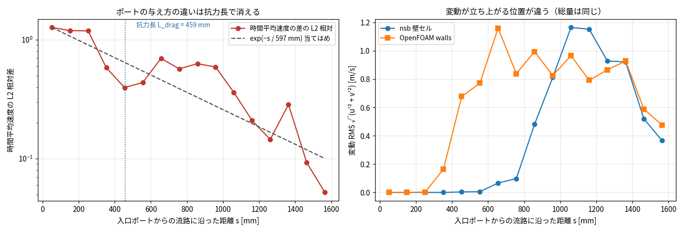</p>

<p style="font-size:12px;color:#555">図 12-2 左: 時間平均速度の差は入口ポートから指数的に減衰する（当てはめ 597 mm、
抗力長 L_drag = 459 mm の 1.30 倍）。右: 変動 RMS の立ち上がる位置が 400 mm ≈ ターン 3 つぶんずれている。</p>

| s [mm] | 平均速度の L2 差 | 変動 RMS nsb | 変動 RMS OF |
|---|---|---|---|
| 50 | 1.27 | 0.000 | 0.000 |
| 252 | 1.19 | 0.000 | 0.003 |
| 353 | 0.58 | 0.000 | **0.164** |
| 454 | 0.40 | 0.003 | **0.677** |
| 656 | 0.70 | 0.066 | 1.159 |
| 858 | 0.63 | **0.481** | 0.994 |
| 1060 | 0.36 | **1.165** | 0.966 |
| 1262 | 0.15 | 0.928 | 0.865 |
| 1564 | **0.05** | 0.365 | 0.475 |

読み方はこう。

1. **変動が生まれる位置が違う。** OpenFOAM は s ≈ 350 mm（2 つ目のターン）で揺らぎ始めるのに対し、
   nsb は s ≈ 750〜850 mm（5 つ目のターン）まで完全に静か。ずれは約 400 mm ＝ ターン 3 つぶん。
2. **下流では同じ量になる。** s > 1000 mm では nsb 0.93〜1.17、OF 0.79〜0.97 で、むしろ nsb の方が大きい。
   総量が違うのではなく、**立ち上がりが遅れているだけ**。
3. **差は入口から指数的に消える。** 当てはめた減衰長 597 mm は、§11.4 で N を決めていた抗力長
   L_drag = ρuh²/(12μ) = 459 mm の 1.30 倍。この問題で 500 mm 級の長さはこれしか無い。
   出口手前（s = 1564 mm）では差が 5% まで落ちる。

つまり食い違いの入口は**ポートの与え方**で、それが**抗力長のスケールで下流に運ばれている**。
nsb の内部ポートはセル内の体積ソース（面内運動量ゼロで注入）なので、入口の流れは滑らかで対称に立ち上がる。
OpenFOAM は流路幅の 83% を占める円板を刳り抜いた実パッチから法線方向に一様流入させるので、
円板の縁から壁沿いに噴流が出て、それが最初のターンで剥離の種になる。**種の有無が 3 ターンぶんの差になる。**

§12.5 の定常検算（0.005 kg/s）で同じポート差が 1.8% に収まったのは、そこでは L_drag = 15 mm で
ポートの痕跡が 1 セル進む前に消えるから。0.15 kg/s では L_drag が 30 倍になり、痕跡が流路の 3 分の 1 を旅する。
**同じモデル差が、N が変わると局所誤差にも大域誤差にもなる。**

<p align="center">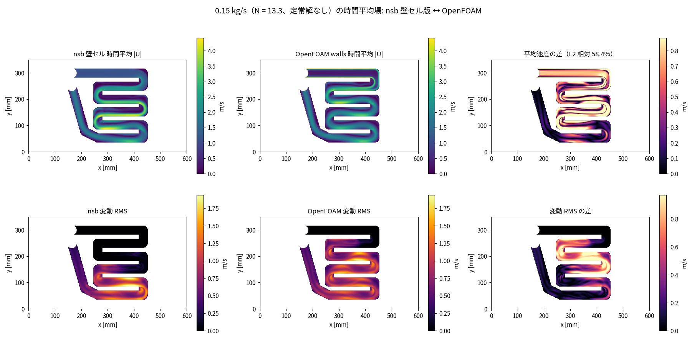</p>

<p style="font-size:12px;color:#555">図 12-3: 時間平均場（上段）と変動 RMS（下段）。下段左の nsb は上側の蛇行が
真っ黒（変動ゼロ）で、下段中央の OpenFOAM は同じ場所が既に光っている。</p>

### 12.8 結論

- 閉塞域を Brinkman 抗力の栓で表すのをやめ、**面を no-slip 壁にして方程式ごと落とす**ようにした。
  幾何としては「境界を領域の内部の面にも置く」だけで、壁面 1 枚の役割は 4 辺の WALL 面と同じ。
- 効くのは大きさ（自由度 279600 → 74664）だけではなく、**流路 : 閉塞 = 1 : 1.4×10⁵ の抗力コントラストが
  消えること**。同じ大きさのままコントラストを 2 桁下げるだけで GMRES が半減し壁セル版と並ぶ。
  物理を壊さずにコントラストを消す方法は、閉塞域を解かないこと以外に無い（h_blocked を上げると Δp が 24% 落ちる）。
- 非定常 1 ステップが **46.7 s → 2.07 s**（22 倍）。0.15 kg/s の物理時間 4.17 秒が 2.53 時間で回る。
- 定常解がある流量（0.005 kg/s）では OpenFOAM と**速度 1.8% / 圧力 0.07%** で一致する（栓モデル同士は 8% で頭打ちだった）。
- 0.15 kg/s の時間平均では、**積分量は合う**（平均流速 0.06%、圧力 span 3.4%、必要ヘッドの振れ幅 9.7% vs 9.1%）が、
  **場は合わない**（L2 58%）。原因はポートの与え方で、差は抗力長 L_drag のスケールで下流に減衰する。
  ポートを実パッチに近づけない限りこの差は残る。
- **§11 の結論（境目は N ≈ 2、0.15 kg/s の答えは非定常の時間平均）は変わらない。** 0.025 kg/s が
  凍結問題で 1.4e-6 まで落ちるようになったのは解きやすさの話で、解凍した真の残差は 1.9e-3 のまま。

### 付録 §12: 再現コマンド

```bash
# 壁セルの効果（uturn、コントラストと大きさの切り分け）
python - <<'PY'
from nsb.core import NSBInput, NSBSettings
from nsb.geo import make_uturn_h, uturn_bc_preset, LX, LY
from nsb.solver import solve_steady
h = make_uturn_h(144, 96, h_channel=1e-3, h_blocked=1e-5)
inp = NSBInput(nx=144, ny=96, lx=LX, ly=LY, h=h, bc=uturn_bc_preset(96, u_in=1.0),
               h_solid=1e-4, settings=NSBSettings(linear_solver="jfnk"))
print(solve_steady(inp).elapsed)
PY

# trama 定常（0.005 kg/s）とオラクル検算
python experiments/nsb/trama_case.py ../tmp/pattern.json --mass 0.005 --dx 1.5 --port interior     --continuation 0.0015,0.005 --freeze 1e-3 --steady-ser --max-iter 120     --linear-solver jfnk --h-solid 1e-4 --tag SOLID-oracle-m0005
python experiments/nsb/trama_of_verify.py --exclude-cells 25     --nsb experiments/nsb/results/trama_SOLID-oracle-m0005_fields.npz --of <of>/walls-m0005

# 非定常（2.5 時間）と時間平均の突き合わせ
~/.claude/hooks/memcap -m 24G -- python experiments/nsb/trama_case.py ../tmp/pattern.json     --mass 0.15 --dx 1.5 --unsteady 0.001 --n-steps 4400 --newton-per-step 6 --save-every 100     --linear-solver jfnk --ls 4 --h-solid 1e-4 --avg-start 2.5 --no-stop-at-steady     --tag SOLID-unsteady-dx1.5-dt1ms
python experiments/nsb/run_trama_of.py ../tmp/pattern.json --variant walls --out <of>/walls-t2     --dx 1.5 --mass 0.15 --transient --end-time-s 1.5 --avg-start 0.3 --max-co 5     --init-from <of>/walls-t --of-cpus 4
python experiments/nsb/trama_solid_compare.py     --nsb experiments/nsb/results/trama_SOLID-unsteady-dx1.5-dt1ms_fields.npz --of <of>/walls-t2
```
