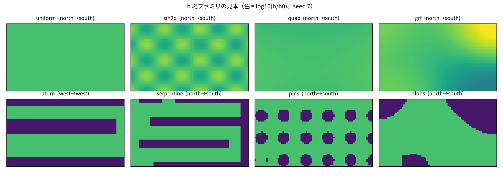
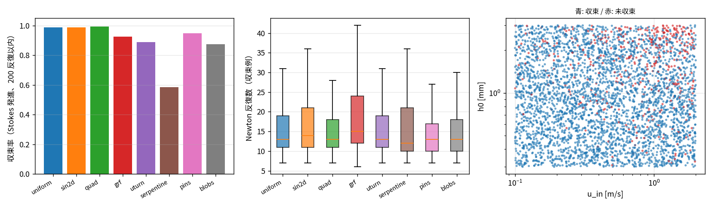
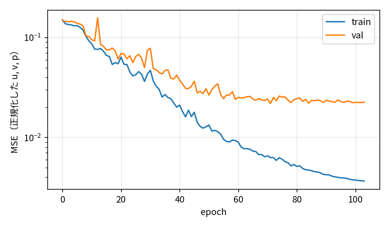
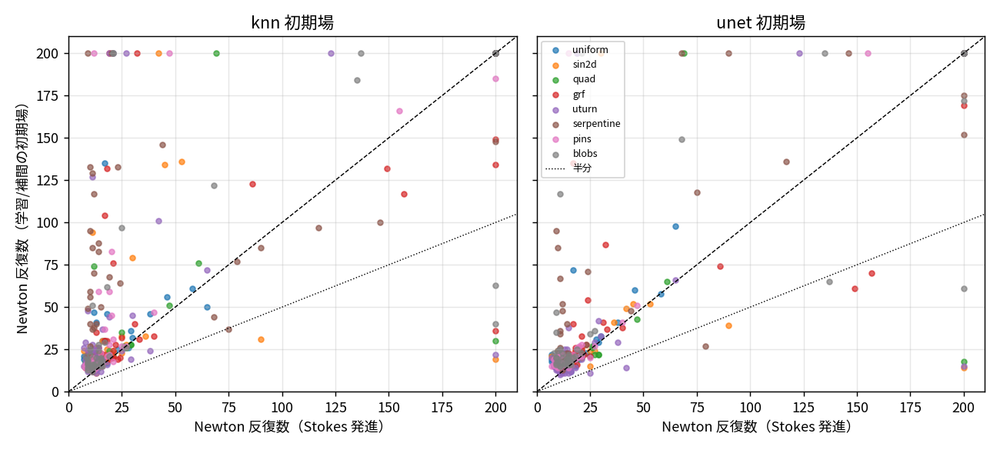
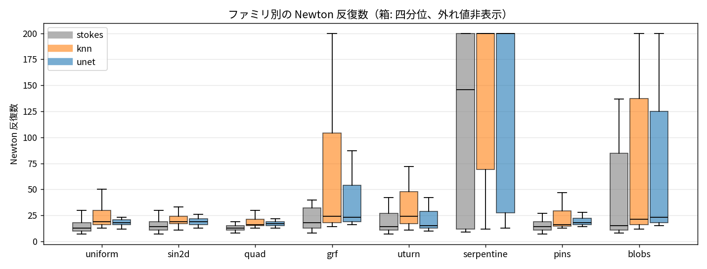
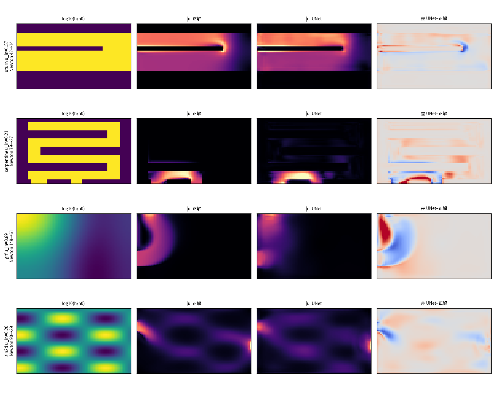

# status-43: nsbm — nsb の初期場を学習で出す（72×48 固定、教師あり UNet、反復数だけを見る）

[<- README](../../README.md) | [status-index](status-index.md) | [status-42](status-42.md) | [nsbm/README](../../nsbm/README.md) | [設計書](../superpowers/specs/2026-09-09-nsbm-learned-initializer-design.md) | [roadmap](../roadmap.md)

日付: 2026-09-09 / ブランチ: `claude/nsbm-learned-init` / gyp さんの依頼「NSB ソルバーに torch でメタ学習を追加し、最良の初期解を出して反復回数を削減する。LX, LY, NX, NY は固定、h と u_in と inlet/outlet 位置を変える。反復にかかる時間は置いておき反復回数だけ見る。格子は 72×48、教師あり、空きコア数だけ並行で流す。h は uturn だけでなくランダム・2 次元 sin・2 次関数・細いパターン流路まで網羅的に」

## 1. 結論

- **学習した初期場は、既定の制御則では Newton 反復数を減らさない**（テスト 357 件、72×48、`cfl_init` 0.25）。
  UNet 初期場は Stokes 発進に対し 41 勝 17 分 299 敗（中央値 19 vs 13）、学習なしの kNN 補間も 34 勝 302 敗で同じ。
  効くのは Stokes 発進が遅い裾（60 反復超の 20 件ほどが 15〜60 に縮む）と、**Stokes 発進で未収束だった 60 件のうち 8 件
  （kNN は 9 件）を収束させる**ところだけ。UNet と kNN の直接対決は 168 勝 34 分 155 敗で、学習の価値は kNN と同程度。
- **機構は 3 つ**（§4）。(a) 閉塞セルの僅かな速度が Brinkman 抗力 12μ/h² で 1e4 倍に増幅され残差比 1000 になる
  → 後処理マスクで 2〜7 に落ちる。(b) 72×48 の Stokes 発進の反復数の大半は SER の CFL 梯子（0.25 → 数百、約 10 段）で、
  初期場は残差比 |R(init)|/|R_ref| が 1 を大きく割らない限り出発 CFL を上げられない。予測場の残差比は 2〜8
  （高波数のごみ: 発散・圧力の細かい誤差）で、Stokes 場より悪い。(c) 予測場から減衰なしの Newton 1 歩（厳密ヤコビアン）を
  試すと 6 割のケースで残差が増えて棄却される。予測場は Newton の吸引域の外にあり、擬似時間の継続法が実際の仕事をしている。
- **出発 CFL の方が大きなレバー**: `cfl_init` を 0.25 → 4 にするだけで Stokes 発進の中央値 13 → 7、未収束 11/357（3%）、
  hard 60 件のうち 9 件が収束する。学習初期場は cfl 4 でも Stokes に勝てない（37 勝 310 敗）。
- 副産物: 8 ファミリ × 4 壁ポートの θ サンプラー（`nsbm/families.py`）、4000 件のデータセット（収束 89.6%）、
  並列生成・学習・評価の一式。時間は見ていない（1 件 0.3〜8 s、UNet 推論 10 ms）。
- 次の一手（§9）: 残差そのものを損失にする（本物の離散演算子で J^T v）、出発 CFL を θ から予測する、
  細格子（288×192、Stokes 発進 43 Newton）で入れ子の粗格子解の代わりに使う。72×48 で反復数を減らす余地は
  「CFL 梯子の段数」そのものなので、初期場より制御則側にある。

## 2. 全体像

```
   θ = (h 場ファミリ 8 種, u_in, inlet 壁/区間, outlet 壁/区間)          固定: 72×48, 0.7×0.4 m, 水の物性
        │
        ▼  nsbm/families.py   seed → θ（決定的）。閉塞系は inlet-outlet の連結を確認、繋がらなければ再抽選
   ┌───────────────────────────────────────────────────────────────────────────┐
   │ nsbm/dataset.py  4000 件を nsb（Stokes 発進、既定設定、上限 200 反復）で解く     │
   │   spawn Pool、ワーカー 1 スレッド、空きコアに追従（他セッションのジョブと共存）   │
   │   → npz シャード: x (8ch 入力画像), y (正規化した u, v, p), θ, n_iter, converged │
   └───────────────────────────────────────────────────────────────────────────┘
        │  収束した 3582 件だけをファミリ層化で train/val/test = 80/10/10
        ▼
   nsbm/model.py  UNet 4 段（72×48 → 9×6）、約 2M パラメータ、MSE、CPU torch、120 epoch
        │
        ▼
   nsbm/evaluate.py  テスト θ ごとに 3 通りの初期場で solve_steady → Newton 反復数
        Stokes 発進（現状） / kNN 補間（学習なしの基準） / UNet
        + hard 集合（Stokes 発進で未収束だった θ）を初期場が救えるか
```

入力画像 8 ch: log(h/h0)、log h0、log u_in（定数面）、inlet 境界セルの u_in·n（2 ch）、outlet マスク、x/LX、y/LY。
出力は u/u_in、v/u_in、p/p_ref（p_ref = 12μu_in LX/h0² + ρu_in²。Brinkman 支配と慣性支配の両方の圧力スケールを含み、
θ だけから決まるので推論結果を物理量に戻せる）。

## 3. θ の空間とデータセット



| family | 生成 | 閉塞 |
|---|---|---|
| uniform | h0 一様 | なし |
| sin2d | h0·exp(a sin(2πkx x/LX+φ) sin(2πky y/LY+ψ))、a∈[0.2,1]、k∈[0.5,4] | なし |
| quad | h0·exp(a((x−x0)²/LX² ± (y−y0)²/LY²))、a∈[−1,1] | なし |
| grf | 対数正規ガウス場（相関長 [0.03,0.2] m、σ∈[0.3,1]） | なし |
| uturn | 既存 `make_uturn_h`（inlet/outlet は west、折返し幅 [0.05,0.2]） | h0/100 |
| serpentine | 2〜5 往復の蛇行流路（流路高さ [0.03,0.1]、端で交互に連結） | h0/100 |
| pins | 円柱ピンフィン配列（正方/六方、ピッチ [0.05,0.15]、径/ピッチ [0.3,0.6]） | h0/100 |
| blobs | ガウス場の分位点 2 値化（開口率 [0.4,0.8]） | h0/100 |

共通: h0 対数一様 [0.3e-3, 3e-3] m、u_in 対数一様 [0.1, 2] m/s、inlet/outlet は 4 壁いずれかに長さ [0.05, 0.15] m。
閉塞系はポートから内側へ最初の開きセルまで廊下を切る。連結しない θ の棄却率は約 3%。



4000 件（seed 0〜3999）、**収束 3582 件（89.6%）**。1 件は 1 スレッドで 0.3〜8 s（4 ワーカーで 25 分。
他セッションの学習ジョブが 15 コアを使っていたので空きに合わせた）。

| family | n | 収束率 | Newton 中央値（収束例） |
|---|---|---|---|
| uniform | 455 | 0.99 | 13 |
| sin2d | 471 | 0.99 | 14 |
| quad | 558 | 0.99 | 13 |
| grf | 490 | 0.93 | 16 |
| uturn | 516 | 0.89 | 13 |
| serpentine | 552 | 0.58 | 12 |
| pins | 516 | 0.95 | 13 |
| blobs | 442 | 0.87 | 13 |

未収束は 2 種類ある。(a) 遅いだけ（seed 4 の serpentine: 80 反復で打ち切られていたが 115 反復で収束。CFL が 1 付近で
成長と縮小を繰り返す）、(b) 停滞（seed 7 の blobs: 300 反復でも |R|/|R_ref| が 4e-2、CFL 0.5 で頭打ち。閉塞後流の
剥離で定常解に届かない）。生成時の上限を 80 → 200 にして (a) を拾い、(b) は未収束として記録した。未収束は
高 u_in・厚い h0（= 慣性が効く側）に集中し、serpentine は往復数が多いほど落ちる。

## 4. メカニズム: 初期場の残差と Newton 反復数の関係

学習を回す前に pilot（400 件、5 epoch）で分かった 2 つの機構が、この課題の骨格になる。

### 4.1 閉塞セルの速度が残差を 1000 倍にする

```
   開きセル   h = h0        抗力係数 12μ/h²  =  12μ/h0²          ┐
   閉塞セル   h = h0/100    抗力係数 12μ/h²  =  12μ/h0² × 10⁴    ┘ 比 10⁴

   予測場の閉塞セルに残る速度 δu（相対 1e-3 でも）
        → 運動量残差  (12μ/h²)·h·δu·V  が開きセルの主要項の 10 倍
        → |R(init)| / |R_ref| ≈ 1000（kNN も UNet も同じ）
        → SER の出発 CFL = 0.25·|R_ref|/|R(init)| ≈ 2.5e-4  → 反復数が Stokes 発進より増える
```

残差の内訳（pilot、blobs seed 86、|R|/|R_ref|）:

| 初期場 | 合計 | u 開き | u 閉塞 | v 開き | v 閉塞 | p 開き |
|---|---|---|---|---|---|---|
| kNN | 2021 | 0.3 | 1593 | 1.2 | 1244 | 1.4 |
| UNet（5 epoch） | 2019 | 6.2 | 1060 | 14.6 | 1718 | 23.4 |
| kNN + 閉塞セルの速度を 0 | **1.9** | 0.3 | 0.1 | 1.2 | 0.1 | 1.4 |
| 正解の u, v + kNN の p | 1.7 | 0.7 | 0.7 | 1.0 | 0.4 | 0.9 |

対策は後処理 `mask_blocked`（閉塞セルの速度を 0、圧力はそのまま）。入力画像の ch0 から閉塞を復元できるので
推論側だけで済む。残る数倍は予測速度の**発散**（p 方程式＝質量保存の残差）で、これは場を滑らかに近似する限り消えない。

### 4.2 Stokes 発進の反復数は SER の CFL 梯子で決まっている

72×48 の Stokes 発進は 10〜16 反復で収束するが、その大半は擬似時間の CFL を 0.25 から数百まで 2 倍ずつ登る
梯子（約 10 段）で、非線形性そのものではない。pilot のテスト 12 件で `cfl_init` を掃引すると:

| cfl_init | Stokes 発進: 収束/12 | 中央値 | kNN 初期場: 収束/12 | 中央値 |
|---|---|---|---|---|
| 0.25（既定） | 12 | 14.5 | 11 | 20.0 |
| 1 | 11 | 10.0 | 11 | 14.0 |
| 4 | 11 | 9.0 | 12 | 15.0 |
| 16 | 10 | 7.5 | 11 | 38.5 |
| 64 | 9 | 8.5 | 11 | 18.0 |

出発 CFL を上げれば Stokes 発進でも反復は半分になるが未収束が増える（status-41 で 0.25 に落とした理由と同じ）。
つまり初期場で反復数を減らすには、**残差比 |R(init)|/|R_ref| を 1 より十分小さくして SER の出発 CFL を自動的に
大きくする**しかない。補間・予測で得られる場の残差比は 1〜5（Stokes 参照と同程度）なので、既定の制御則では
中央値は動かず、**Stokes 発進が遅い裾（seed 36: 107 → 29）だけが縮む**。これが評価で見るべき形。

### 4.3 見送った案: 発散ペナルティ

p 方程式の残差を直接下げるため、正規化速度の離散発散（面平均近似）を損失に足す案を測った。正解場の発散が 5.5e-3 に
対し**ぼかした場は 1.5e-3 と正解より小さく**、面平均近似は nsb の Rhie–Chow 離散発散と一致しないので、正解から
遠ざける方向に働く。本物の離散演算子（`BrinkmanDiscretization.residual_fast`）を損失にするには彩色 FD ヤコビアンで
J^T v を返す autograd Function が要る（設計書の「残差駆動」案）。今回は教師ありの範囲で止めた。

## 5. 学習



- 収束 3582 件をファミリ層化で train 2867 / val 358 / test 357（seed 単位、`runs/unet-a/split.json`）。
- UNet 4 段 widths (32, 64, 128, 256)、約 2M パラメータ、AdamW lr 1e-3・weight decay 1e-4・cosine、batch 32、
  8 スレッド CPU。**val MSE は epoch 71 で 0.0219**（train 0.0065）に達して頭打ち、以後 train だけ 0.0037 まで下がる
  （過学習側）。1 epoch は 16〜95 s（他セッションのジョブと共存で振れる）、104 epoch で 53 分。120 epoch 予定を
  lr < 5e-5 の終盤で打ち切り、`best.pt` = epoch 71。
- 正規化 MSE 0.022 は「u/u_in で RMS 0.15」相当。場の見た目は正解に近い（§6 の図）が、残差で測ると Stokes 場より悪い。

ログ: `experiments/nsbm/logs/train-unet-a-1788793288.log`、生成: `logs/gen-1788788986.log`（+ `gen-fix3000-*.log`）。

## 6. 結果: Newton 反復数の比較

評価の手順: テスト θ ごとに `solve_steady` を 3 通りの初期場で回す（`newton_max_iter=200`、他は既定）。
kNN / UNet の初期場は `mask_blocked` 後処理つき。指標は Newton 反復数 `n_iter`、初期残差比 r0 = |R(x0)|/|R_ref|、
出発 CFL。「hard」は Stokes 発進で未収束だった θ（学習には使っていない）60 件を別枠で評価したもの。
ログ: `experiments/nsbm/logs/eval-unet-a-cfl0.25-*.log`、`eval-unet-a-cfl4-*.log`、`eval-unet-a-cfl0.25-newton-*.log`、
結果: `experiments/nsbm/results/eval-unet-a-*.{yaml,csv}`。

### 6.1 既定の制御則（cfl_init 0.25）

| 初期場 | 収束/357 | Newton 中央値 [q1, q3] | 平均 | r0 中央値 | 対 Stokes 勝/分/敗 | hard 60 件の収束 |
|---|---|---|---|---|---|---|
| Stokes 発進（現状） | 357 | **13** [11, 19] | 20.6 | 1.00 | — | 0 |
| kNN 補間（k=4） | 341 | 19 [16, 32] | 38.4 | 2.82 | 34/21/302 | 9 |
| UNet | 344 | 19 [16, 24] | 30.7 | 7.06 | 41/17/299 | 8 |

UNet vs kNN: 168 勝 34 分 155 敗。ファミリ別（中央値、Stokes / kNN / UNet）: uniform 13/19/18、sin2d 14/19/19、
quad 13/16/17、grf 17/22/22、uturn 13/19.5/15、serpentine 12/69/27.5、pins 14/16/17、blobs 14/19/20。
閉塞の複雑な serpentine で kNN が崩れ（近傍の形状が違う場を平均すると流路が繋がらない）、UNet はそこだけ大きく勝つ
（24 勝 8 敗）。uturn も UNet が 33 勝 8 敗。滑らかなファミリでは差がない。



散布図の読み方: 対角より下が「初期場で減った」。大半が対角の上（10〜20 反復の Stokes 発進に対し 15〜25）。
右端の x=200（Stokes 未収束の hard 集合）で 15〜60 に落ちる点が「救えた」ケース。





場の比較（テスト集合で UNet の反復数比が最も良かったケース、ファミリ重複なし）。形は合っているが、
反復数が減る保証にはならない。

### 6.2 出発 CFL を上げる（cfl_init 4、3 方式とも同じ値）

| 初期場 | 収束/357 | Newton 中央値 [q1, q3] | 平均 | 対 Stokes 勝/分/敗 | hard 60 件の収束 |
|---|---|---|---|---|---|
| Stokes 発進 | 346 | **7** [6, 11] | 20.1 | — | 9 |
| kNN 補間 | 315 | 12 [8, 41] | 45.4 | 35/13/309 | 11 |
| UNet | 335 | 11 [10, 31] | 36.6 | 37/10/310 | 9 |

Stokes 発進は cfl 4 で中央値が半分になる（未収束 3%）。学習初期場は cfl 4 でも Stokes より多く、しかも未収束が増える。
「良い初期場なら攻めた CFL で出発できる」は成り立たなかった。予測場の残差が高波数側にあるので、大きな CFL は
その誤差を Newton 修正量に乗せて発散させる。

### 6.3 予測場の Newton 射影（cfl_init 0.25）

予測場から厳密ヤコビアン（彩色 FD、`nsb.adjoint.colored_fd_jacobian`）で減衰なしの Newton を 1〜2 歩進めてから
初期場にする（`nsbm/project.py`。残差が減らなければ手前で止める）。

| 初期場 | 収束/357 | Newton 中央値 | 平均 | r0 中央値 | 射影が採用された割合 | 対 Stokes 勝/分/敗 | hard の収束 |
|---|---|---|---|---|---|---|---|
| kNN + Newton 1 歩 | 342 | 19 | 37.3 | 1.97 | 34% | 77/24/256 | 10 |
| UNet + Newton 1 歩 | 345 | 20 | 32.7 | 3.76 | 40% | 62/32/263 | 8 |
| UNet + Newton 2 歩 | 345 | 19 | 31.9 | 3.49 | 68%（累計） | 94/20/243 | 8 |

射影は 6 割のケースで残差を**増やす**ので棄却され、採用された場合も残差比は 1〜2 に留まる。予測場（残差比 2〜8）は
Newton の吸引域の外にあり、SOU リミターの折れ点で線形化が当たらない。擬似時間の減衰は飾りではなく、
この距離を詰める実際の仕事をしている。

## 7. 事故と修正（設計上の論点として）

- **`load_shards` のメモリ爆発**: npz の `z["x"][k]` をサンプルごとに呼ぶと、毎回展開されるシャード全体配列が
  スライスのビューに掴まれて残る（1 件 37 MB × 数百件 = 十数 GB）。3 回の thrash（別セッション messi-bb が kill）は
  全てこれ。キーごとに 1 回読む形に直し、3750 件で maxrss 688 MB を確認した。以後 python は heredoc 含め
  `memcap -m 12G` 配下で起動する。
- **spawn の `__main__` ガード**: scratch の掃引スクリプトにガードが無く、子が本体を再実行して Pool を再帰生成した。
- **同壁ポートの抽選失敗**: uturn（両方 west）で長さ 0.15 ずつだと 20 回の再抽選で重ならない配置を引けないことがあり、
  seed 3000〜3249 のチャンクが落ちた。構成的配置（inlet の残り側に詰める）をフォールバックにして再生成。

## 8. ファイル

| ファイル | 役割 |
|---|---|
| `nsbm/families.py` | `Theta` / `sample_theta` / `build_h` / `build_bc` / `build_input` / `connected` |
| `nsbm/features.py` | 入力 8 ch、正規化・逆変換、`mask_blocked` |
| `nsbm/dataset.py` | `solve_sample` / `generate`（spawn Pool）/ `save_shard` / `load_shards` |
| `nsbm/model.py` | `UNet` |
| `nsbm/train.py` | `split_by_family` / `train` / `load_model`（`divergence_loss` は見送り、コードは残す） |
| `nsbm/evaluate.py` | `knn_predict` / `run_with_init` / `evaluate`（`--methods` で `unet_n2` 等の Newton 射影つき方式）/ `summarize` |
| `nsbm/project.py` | `newton_project`（彩色 FD の厳密ヤコビアンで減衰なし Newton、残差が減らなければ手前で止める） |
| `experiments/nsbm/gen.py`, `gen_chunks.sh`, `train.py`, `eval.py`, `report_figs.py` | 入口。ログは `experiments/nsbm/logs/` |
| `tests/test_nsbm_*.py` | 37 件（families 21・features 4・dataset 2・model/train/evaluate 9・project 1。slow 3）。全件は 978 passed / 18 failed（既存）/ 1 xfailed、契約違反 1 件（既存: `BenchmarkRunnerProcess` の C3） |

## 9. TODO

- [ ] **残差駆動の学習**: 損失を |R(net(θ); θ)| そのもの（`residual_fast`）にし、勾配は彩色 FD ヤコビアンの J^T v を返す
  autograd Function で流す。予測場の残差比を 1 未満に持っていけるかが分岐点。MSE では場は合っても残差は合わない（§4.2、§6.3）
- [ ] **出発 CFL の予測**: θ（あるいは Stokes 場の残差分布）から `cfl_init` を出す小さな回帰。cfl 4 で中央値 13 → 7、
  未収束 3% なので、未収束になる θ だけ 0.25 に戻せる分類器で十分に効く（§6.2）
- [ ] **細格子での評価**: 72×48 は Stokes 発進で 13 反復と既に短い。288×192（Stokes 発進 43、入れ子 13）で
  UNet 初期場を双一次補間して入れ、粗格子解（status-41）と比べる。反復数の下限が CFL 梯子で決まる構造は同じなので
  期待値は入れ子と同程度
- [ ] hard 集合（剥離で定常解に届かない θ）の扱い: 8〜11 件は初期場で収束したが、残りは定常解が無い可能性。
  非定常性の判定（残差の振動）を `NSBResult.failure_reason` に足す
- [ ] `divergence_loss` は本物の離散発散（Rhie–Chow 面速度）に置き換えるか削除する
