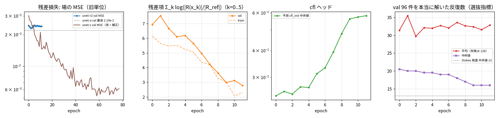
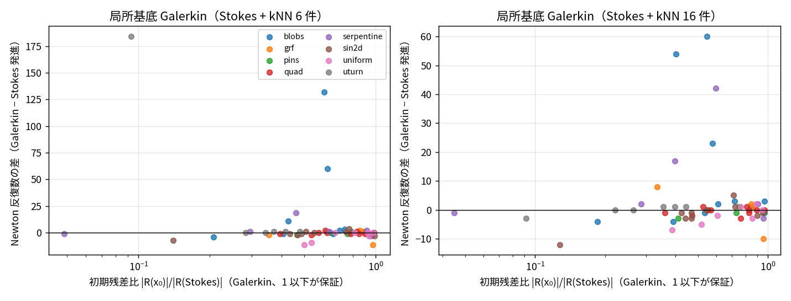
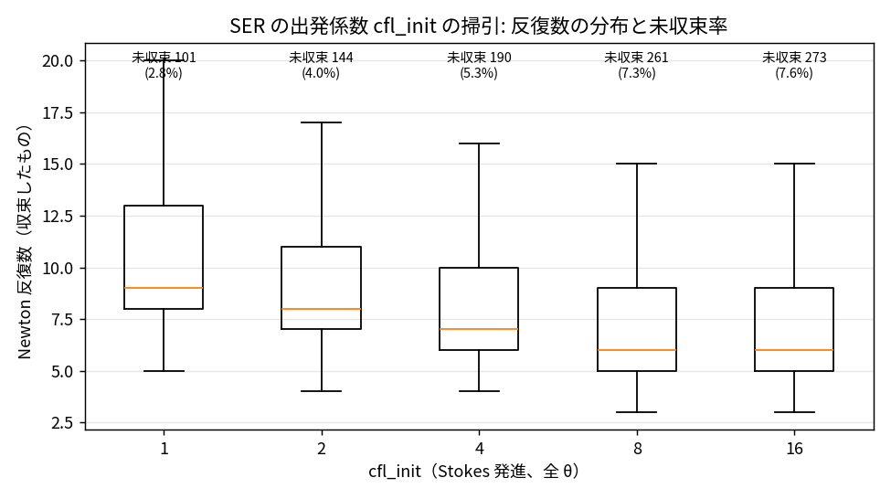
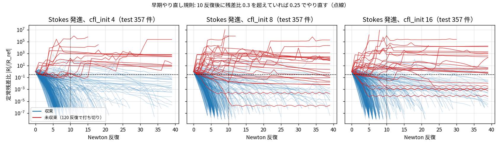

# status-44: nsbm 第 2 段 — 残差損失 + cfl_init ヘッド、Stokes 床 + 補正、局所 Galerkin、cfl_init の掃引と選択器

[<- README](../../README.md) | [status-index](status-index.md) | [status-43](status-43.md) | [nsbm/README](../../nsbm/README.md) | [roadmap](../roadmap.md)

日付: 2026-09-09 / ブランチ: `claude/nsbm-learned-init` / gyp さんの指示（07:39）「粗い格子で負けているようなら話にならない。次は u, v, p と cfl_init を出力するモデルに変更し、正則化した真の解との差 + 係数 × 予測場を初期解にした 5 iter の残差の和を損失にする。学習できたらテストデータに対して R² と場の最大最小値の誤差を見る」。途中で messi-bb（別セッションの Claude、サロゲート実験 1 か月）の助言を受け、Stokes 床 + 補正の路線を追加（gyp さん 08:43「ストークス解の修正量を出すの良いですね」）。

## 1. 結論

status-43 の「学習初期場は反復数を減らさない」を、4 つの独立な角度から詰めた。答えは変わらないが、**なぜ減らないかの因果と、代わりに何が効くかの数字**が揃った。

| 角度 | 何をしたか | 結果（テスト 357 θ、72×48） |
|---|---|---|
| **A. 場の精度** | Stokes 解を床にして UNet は修正量だけを出す（unet-s） | R² u 0.91 → 0.97、p の per-instance 0.53 → 0.97。反復は 149 勝 173 敗（残差比 2.1 のまま）。**Newton 射影 1 歩を足すと 207 勝 138 敗、開いた流路（uniform / quad / sin2d）では中央値 13 → 7**、閉塞系は壁際の残差で負け（§4） |
| **B. 残差損失 + cfl ヘッド** | gyp さん指定の損失で unet-a を微調整（unet-r / r2） | 残差項は下がり cfl_init は上がるが、**実反復数は Stokes 発進より多い**（§5） |
| **C. 学習なしの下限線** | Stokes + kNN 近傍解の局所基底で残差最小化（Galerkin） | 初期残差比 0.57〜0.64 に落ちても反復数は五分（25 勝 13 分 22 敗）。**残差を減らした場ほど破綻する**（§6） |
| **D. cfl_init そのもの** | 全 3582 θ × cfl_init {1,2,4,8,16} の掃引、選択器、早期やり直し規則 | 固定 0.25 の平均 20.6 → **早期やり直し規則 15.9** ≈ 学習した選択器 16.8、オラクル 10.8（§7） |

一言でいうと: **72×48 の反復数は「初期場がどれだけ解に近いか」ではなく「SER の CFL 梯子を何段登るか」と「Newton の吸引域に入っているか」で決まる**。初期残差を部分空間で下げること（Galerkin、残差損失）は前者を 1 段分（log₂(1/0.6) ≈ 0.7 反復）しか稼がず、後者を悪化させうる。効くのは (i) 出発 CFL と失敗の早期見切り（全ファミリ、学習なし）、(ii) 吸引域に入る場 + 減衰なしの 1 歩（開いた流路で 13 → 7。閉塞系では壁際の残差が残る）の 2 つで、初めて学習初期場が勝つ条件が絞れた。

## 2. 全体像

```
                    θ（8 ファミリ × 4 壁ポート、u_in, h0）        固定: 72×48, 0.7×0.4 m
                            │
          ┌─────────────────┼──────────────────────┬────────────────────────┐
          ▼                 ▼                      ▼                        ▼
   A. 場のサロゲート   B. 残差損失 + cfl ヘッド    C. 局所 Galerkin           D. cfl_init の方策
   unet-a: 場→場       unet-a から微調整          Stokes + kNN 解の         全 θ × {1,2,4,8,16} の
   unet-s: Stokes 床    損失 = MSE + λ Σ log ρ_k   部分空間で |R| 最小       掃引 → 選択器 / 早期やり直し
   + 修正量             ρ_k = |R(x_k)|/|R_ref|     （学習なし）
          │                 │                      │                        │
          └────────┬────────┴──────────┬───────────┘                        │
                   ▼                   ▼                                    ▼
          場の R² / max-min 誤差   nsb を最後まで回した Newton 反復数（Stokes 発進 0.25 が基準線）
```

評価の基準線は status-43 と同じ: Stokes 発進、`cfl_init` 0.25、テスト 357 θ（収束解を持つ θ のファミリ層化 10%）。

## 3. 部品（新規）

| ファイル | 役割 |
|---|---|
| `nsbm/residual_loss.py` | `unroll`（予測場から nsb の `solve_linear` で擬似時間 Newton を K 歩。状態列は実機と同じ経路）、`residual_loss`（Σ_k w(ρ_k) と凍結ヤコビアン随伴による ∂/∂x_0・∂/∂log cfl_init）、`ResidualLossPool`（spawn 並列、`solve` で最後まで解く）、`straight_through`（torch へ値と勾配を直通） |
| `nsbm/model.py` | `UNet` に cfl ヘッド: ボトルネックの大域平均 → MLP → `log cfl_init = log 0.25 + ln64·tanh(z)`（[0.004, 16]、ゼロ初期化で既定 0.25）。`in_ch` を持つ |
| `nsbm/floor.py` | Stokes 床: `instance_scale`（s_u = max(rms\|u_S\|, 0.05)、s_p = max(std p_S, ρu_in²/p_ref)）、`floor_input`（11 ch）、`floor_predict`（y = y_S + s·c、閉塞セルの u, v は 0）、`floor_loss`（開きセルだけの ((y − y_true)/s)²） |
| `nsbm/galerkin.py` | `stokes_field`、`galerkin_init`（Stokes + 近傍解の張る部分空間で Gauss–Newton、残差が減らなければ半分に刻む） |
| `nsbm/train.py` | `floor` モード、`res_weight` / `res_cfl_gain`、`val_solve`（val の一部を本当に解いた平均反復数で best.pt を選ぶ）、`last.pt` / `epoch-XXX.pt`、非有限の損失・勾配のバッチを捨てる NaN ガード |
| `nsbm/evaluate.py` | 方式名 `base[_nK][@cfl]`（`stokes@4`、`unet@pred`）、`field_metrics`（pooled / per-instance R²（中央値・q10・q90・min）、最大値・最小値の誤差） |
| `experiments/nsbm/` | `stokes_fields.py`（床 4000 件 80 s）、`cfl_labels.py`（掃引 17910 走行 87 分）、`cfl_select.py`（選択器）、`cfl_histories.py` + `early_restart.py`（早期やり直し規則）、`pod_nwidth.py`、`galerkin_spike.py`、`report_figs44.py` |

テスト: `tests/test_nsbm_residual_loss.py`（K=0 の勾配は FD と 1e-3 で一致、K=2 直接解モードで log cfl の勾配 5% 一致・x_0 の勾配は降下方向、展開ループの残差履歴は nsb と 25% 以内）、`tests/test_nsbm_galerkin.py`、`tests/test_nsbm_model.py`（cfl ヘッド、床モード、旧 ckpt の読み込み）。

## 4. A. 場の精度: Stokes 床 + 補正で何が変わったか

### 4.1 なぜ場→場の UNet は R² 0.9 で止まるか

unet-a（status-43、場→場、大域正規化 u/u_in, p/p_ref）のテスト精度は次のとおり。

| チャネル | R²（pooled） | R²（per-instance 中央値 / q10） | 最大値誤差 中央値（正規化単位 / 値域比） | 最小値誤差 中央値 |
|---|---|---|---|---|
| u | 0.912 | 0.857 / 0.640 | 0.19 / 8.7% | 0.15 / 7.8% |
| v | 0.833 | 0.855 / 0.628 | 0.15 / 8.7% | 0.15 / 8.4% |
| p | 0.889 | 0.525 / **−4.19** | 0.075 / 16% | 0.052 / 11% |

圧力の per-instance R² が崩れる機構は正規化にある。p_ref = 12μu_in LX/h0² + ρu_in² は θ から決まる大域スケールで、圧力変動の小さいケースでは SST_i が小さく、同じ絶対誤差でも R²_i が負に振れる。messi-bb の助言（1 か月の実測）は 3 点: (a) 安い物理解を床にして NN は差分だけ出す、(b) インスタンスごとに rms(床解) でスケールする、(c) 壁セルは出力を硬く 0 にし損失は開きセルだけ。

### 4.2 床の落とし穴: 慣性支配では Stokes 圧力は桁で小さい

床のスケール s_p = std(p_S) だけで割ると、val の床損失（学習前 = Stokes 解の誤差）が 85 に爆発した。内訳は速度 2 成分が中央値 0.02〜0.03・最大 1.3 と健全で、圧力が最大 73430。pins（u_in 1.3 m/s、h0 2.7 mm）では Stokes 圧力の std が真値の 1/18 しかない。慣性支配のケースでは Stokes 解は圧力のスケールを持っていないので、s_p = max(std p_S, ρu_in²/p_ref) と慣性スケールを下限に入れた（速度は 0.05 を下限）。これで床損失は 0.35 に落ち、圧力チャネルの寄与は中央値 0.21 になった。

### 4.3 unet-s の結果: 場の精度は上がり、開いた流路では射影 1 歩で反復が半減する

100 epoch（val 床損失最良は epoch 91、旧単位の val MSE 5.7e-3 = unet-a の 1/3.8）。テスト 357 θ:

| チャネル | R²（pooled）unet-a → unet-s | R²（per-instance 中央値 / q10 / q90） | 最大値誤差 中央値（正規化単位 / 値域比、p90） | 最小値誤差 中央値 | Stokes 床だけの R²（pooled / 中央値） |
|---|---|---|---|---|---|
| u | 0.912 → **0.973** | 0.975 / 0.83 / 0.995 | 0.094 / 5.0%（p90 21%） | 0.098 / 5.1% | 0.955 / 0.942 |
| v | 0.833 → **0.916** | 0.956 / 0.80 / 0.990 | 0.120 / 6.4%（p90 29%） | 0.101 / 5.7% | 0.637 / 0.891 |
| p | 0.889 → **0.961** | 0.972 / −0.62 / 0.999 | 0.015 / 3.4%（p90 20%） | 0.010 / 2.2% | 0.774 / 0.699 |

圧力の per-instance R² は 0.525 → 0.972（q10 は −4.2 → −0.6、最小 −107 の外れ値は残る）。Stokes 床は u の 95% を既に説明しており、unet-a（0.912）は床より悪かった。

反復数（Stokes 発進 0.25 が基準、`unet_n1` は予測場から厳密ヤコビアンの Newton 1 歩、減らなければ手前で止める）:

| 方式 | 中央値（q1〜q3） | 平均 | 対 Stokes 勝/分/敗 | 未収束 | 初期残差比 | hard 60 件の救済 |
|---|---|---|---|---|---|---|
| Stokes 発進 0.25 | 13（11〜19） | 20.6 | — | 0 | 1.0 | 0 |
| Stokes @ cfl 4 | 7（6〜11） | 20.1 | 310 / 10 / 37 | 11 | 1.0 | 9 |
| unet-a（status-43） | 19 | — | 41 / 17 / 299 | — | 2〜8 | 8 |
| unet-s | 14（11〜18） | 22.8 | 149 / 35 / 173 | 5 | 2.12 | 10 |
| **unet-s + Newton 射影 1 歩** | 14（**8**〜23） | 22.6 | **207 / 12 / 138** | 5 | 1.12 | 10 |

| ファミリ | n | Stokes 中央値 | unet-s（勝/分/敗、残差比） | unet-s + 射影（勝/分/敗、残差比） |
|---|---|---|---|---|
| uniform | 45 | 13 | 11（30/4/11、1.58） | **7（42/1/2、0.15）** |
| quad | 55 | 13 | 11（36/12/7、1.22） | **7（51/0/4、0.17）** |
| sin2d | 47 | 14 | 12（30/4/13、1.37） | **8（41/0/6、0.20）** |
| grf | 45 | 17 | 18（18/2/25、2.35） | 19（25/1/19、1.42） |
| uturn | 46 | 13 | 13（20/0/26、1.61） | 16.5（17/1/28、1.36） |
| pins | 49 | 14 | 14（8/6/35、3.59） | 15（18/5/26、2.09） |
| blobs | 38 | 14 | 15（4/7/27、3.83） | 17（10/3/25、2.46） |
| serpentine | 32 | 12 | 16（3/0/29、5.84） | 22.5（3/1/28、4.20） |

読み方（機構）:
- **場の精度は残差比を下げない。** unet-s は unet-a より格段に正確だが初期残差比は 2.1 のまま。Stokes 床は R² 0.955 で残差比 1.0。残差は微分レベルの整合（発散・圧力勾配とのつり合い）で決まり、L2 精度とは別の量。
- **吸引域に入っていれば 1 歩で残差は消える。** 射影の採用率は unet-a の 34〜40% から 65% に上がり、採用時の残差は 0.22 倍。開いた流路（uniform / quad / sin2d）では残差比 0.15〜0.20 になり、SER の出発 CFL が 5〜6 倍で始まって中央値 13 → 7。これは `cfl_init` 4 と同じ効きで、しかも未収束を増やさない。
- **閉塞系は壁際で負ける。** blobs / pins / serpentine の残差比は 3.6〜5.8 で、射影後も 2〜4。閉塞セルの速度は 0 に固定してあるので、残るのは壁に隣接する開きセルの残差（Brinkman 抗力が 1e4 倍に跳ぶ段差を挟んだ運動量のつり合い）。ここは予測場の質でなく離散化の局所構造で、射影 1 歩でも吸引域に入らない。
- 遅い裾（Stokes 30 反復超の 40 件）は unet-s でも平均 73 → 78 で変わらない。裾は初期場の問題ではない。

## 5. B. 残差損失 + cfl ヘッド: 損失は下がるが反復数は増える

### 5.1 損失の定義と勾配の通し方

損失 L = MSE(正規化場) + λ Σ_{k=0}^{5} w(ρ_k)、ρ_k = |R(x_k)|/|R_ref|。x_0 は予測場（閉塞セルの速度 0）、x_k は nsb と同じ擬似時間 Newton（SER、局所 Δτ、JFNK + 遅延前処理）を予測 cfl_init で 5 歩進めた場。w は gyp さん指定の「残差の和」（w = ρ）と対数（w = log ρ）の 2 種。

勾配は「1 歩を J_k・D_k を凍結した線形写像とみなす随伴」で通す。舞台は未知数空間 R^{3n}。Newton 1 歩 x_{k+1} = x_k − (J_k + D_k)^{-1} R(x_k) の x_k 依存を J と D を止めて見ると ∂x_{k+1}/∂x_k = (J_k + D_k)^{-1} D_k、つまり「擬似時間の対角 D が大きいほど前の場が残る」線形写像になる。転置系 (J+D)^{-T} を疎 LU で解けば随伴が 1 歩 1 回で済み、D = c/CFL なので同じ転置解 w から CFL への勾配 (D δ)·w / CFL が無料で出る。落としている項は Δτ の速度依存・SER 比の残差依存・J の x 依存（2 階）。k=0 の項は厳密で FD と 5 桁一致、K=2 の直接解モードで log cfl の勾配は FD と 0.5% 一致、x_0 の勾配は方向が合い大きさが 10〜40% ずれる。

実機の 1 歩（JFNK、GMRES 許容 1e-3）は損失面にノイズを持つ。GMRES 許容を満たす δ は前処理の状態で悪条件方向に差が出、悪い初期場からの 1 歩は非線形残差がその差に敏感で、展開ループと `solve_steady` の残差履歴は 13% ずれる（27→106→40.8 vs 27→106→42）。ちなみに厳密ヤコビアンの直接解だと 27→51→8.8 と 2〜3 倍速く落ちる。初期反復での線形解の緩さが反復数に効いている可能性は、nsb 側の別件として残す。

### 5.2 学習の挙動

| 走行 | 損失 | 何が起きたか |
|---|---|---|
| unet-r（初回） | w = ρ、λ = 3e-5 | epoch 0 で崩壊: 学習 MSE 1.4e-3 → 1.4e-2、残差和 91 → 15000、cfl_init 中央値 10。生の残差比の和は発散する歩に上限がなく、悪い場ほど勾配が大きい正帰還 |
| unet-r0 | w = log ρ、λ = 2e-5 | MSE は維持（val 2.19e-2 → 2.43e-2、+11%）、残差項 7.8 → 6.9 → 7.5 で改善せず、cfl_init は 0.258 で動かず。場の勾配（1e2〜1e3）と cfl の勾配（1e0〜1e1）が 2 桁違い、1 つの λ では両方に合わない |
| unet-r | w = log ρ、λ = 1e-5、cfl 勾配 300 倍 | epoch 6 で残差項 6.9 → 0.33、cfl_init 中央値 6.1、val MSE 2.56e-2。**epoch 7 で NaN**（発散した歩の inf 勾配は clip では防げない）。選抜が val MSE + 1e-5×残差で実質 MSE だけだったため、残差が効いた epoch は best.pt に残らなかった |
| unet-r2 | 同上 + NaN ガード + val 96 件を本当に解いた平均反復数で選抜、12 epoch | 残差項 6.9 → 2.8、cfl_init 中央値 0.25 → 0.58、val MSE は 2.4e-2 で維持。val 実反復数は平均 30〜35・中央値 20 → 16・未収束 4〜13/96 で、**どの epoch も Stokes 発進（平均 20.6、中央値 13）に届かない**。選抜は epoch 2 |



テスト 357 θ での評価（unet-r2 の last = epoch 11、cfl_init 予測の中央値 0.58、p10〜p90 0.40〜0.65）:

| 方式 | 中央値 | 平均 | 対 Stokes 勝/分/敗 | 未収束 | 初期残差比 | hard 60 件の救済 |
|---|---|---|---|---|---|---|
| Stokes 発進 0.25 | 13 | 20.6 | — | 0 | 1.0 | 0 |
| Stokes + 予測 cfl（cfl ヘッドだけ） | **10** | 20.0 | 322 / 9 / 26 | 4 | 1.0 | 8 |
| unet-r2 の場、cfl 0.25 | 18 | 29.1 | 54 / 21 / 282 | 9 | 6.7 | 9 |
| unet-r2 の場 + 予測 cfl | 14 | 29.2 | 119 / 28 / 210 | 14 | 6.7 | 7 |

場の精度（R² pooled / per-instance 中央値）: u 0.920 / 0.872、v 0.844 / 0.867、p 0.899 / 0.587。最大値誤差の中央値: u 0.14（値域比 7.2%）、v 0.15（8.4%）、p 0.066（13%）。最小値誤差: u 0.15（8.0%）、v 0.14（7.7%）、p 0.063（14%）。unet-a とほぼ同じで、残差損失は場を良くも悪くもしていない。

読み方: 効いているのは cfl ヘッドだけで、それも予測値が 0.4〜0.65 の狭い帯に収まり「定数 0.6 で出発する」のと同じ働き（固定 cfl 1 の中央値 9・平均 17.9 に及ばない、§7.1）。予測場は初期残差比 6.7 で、5 歩の残差和を下げても実反復数は増える。

### 5.3 なぜ「5 歩の残差和」は反復数の代理にならないか

- **視野が短い。** cfl_init 4 の未収束 11 件は全部 200 反復の停滞（早期発散ではない）で、5 歩では見えない。対数の残差和は「5 歩で残差が増えない」＝小さい CFL を好み、生の残差和は「最初の歩で大きく減る」＝大きい CFL を好む。どちらも「何反復で収束するか」ではない。
- **残差を欺く。** messi-bb の実測どおり、物理残差を損失の正則化項にすると残差を小さくする方向に場を歪める。unet-r は残差項を 6.9 → 0.33 に下げたが val MSE は +17% 悪化し、実反復数は改善しなかった。物理は損失でなく構造（床・射影・反復）に入れるべき、という助言と整合する。

## 6. C. 学習なしの下限線: 局所 Galerkin と POD の n-width

### 6.1 大域 POD は使えない

収束解 2867 件（train、正規化 y）の SVD で、test のファミリ別相対射影誤差（中央値）は m = 20 で 31〜50%、44 で 23〜40%、88 で 17〜34%、176 でも 11〜30%（blobs / pins / serpentine が悪く、uniform / quad / uturn が良い）。inlet / outlet が 4 壁のどこにでも来る設定では解多様体が広く、大域基底を共有できない。大域 POD-20 の初期解は UNet（相対誤差 ~30%）より悪い場になる。

### 6.2 局所基底 Galerkin: 残差は下がるが反復は減らない

基底を「この θ の Stokes 解 + kNN 近傍 k 件の収束解（閉塞マスク適用）」にし、係数を Gauss–Newton で |R(Vc)| 最小化する。Stokes 解が基底に入るので初期残差比 ≤ 1 が保証される。



| k | 初期残差比 中央値 | Newton 反復 中央値（Stokes 14） | 勝/分/敗 | 平均（Stokes 17.1） |
|---|---|---|---|---|
| 6 | 0.64 | 14 | 25 / 13 / 22 | 23.1 |
| 16 | 0.57 | 14 | 26 / 10 / 24 | 19.7 |

大半は ±3 反復の帯に収まり系統的な利得はない。少数（60 件中 3 件）が +40〜+185 反復の破綻をし、それは残差比を大きく下げた場に起きる。機構: 残差比 r で出発 CFL は cfl_init/r に上がる。部分空間で残差最小の場は Newton の吸引域の外にあることが多く、大きい CFL の 1 歩を踏んで棄却・CFL 縮小（×0.1）を食い、梯子を登り直す。**「初期残差を減らせば速い」という前提が、この格子では成り立たない。**

## 7. D. cfl_init そのもの: 掃引・選択器・早期やり直し

### 7.1 掃引（全 3582 θ、Stokes 発進）



| cfl_init | 反復 中央値 | q90（収束分） | 未収束 |
|---|---|---|---|
| 0.25（既定） | 13 | — | 0 |
| 1 | 9 | 24 | 2.8% |
| 2 | 8 | 22 | 4.0% |
| 4 | 7 | 24 | 5.3% |
| 8 | 6 | 27 | 7.3% |
| 16 | 6 | 27 | 7.6% |

中央値は cfl とともに単調に下がるが、未収束率も上がる。テスト 357 θ で失敗の費用を「上限 120 反復 + 0.25 でやり直し」と置くと、固定 1 が平均 17.9、固定 4 が 19.1、固定 16 が 23.4 で、**平均では固定 0.25（20.6）とほとんど変わらない**。θ ごとに最良の cfl を当てるオラクルは平均 10.8・中央値 6 で、伸びしろは半分ある。

### 7.2 選択器（学習あり）

θ の特徴（log u_in、log h0、Re、ファミリ、壁、ポート幅、閉塞率、開口部の h の統計）→ 各 cfl で収束する確率と log 反復数を MLP で予測し、期待費用 P·n̂ + (1−P)·(120 + n̂_{0.25}) が最小の cfl を選ぶ。

| 方策 | 平均 | 中央値 | q90 | 未収束 |
|---|---|---|---|---|
| 固定 0.25 | 20.6 | 13 | 31 | 0 |
| 収束確率 > τ の最大 cfl | 17.3 | 10 | 32 | 0 |
| 期待費用最小 | **16.8** | 7 | 34 | 0 |
| オラクル | 10.8 | 6 | 16 | — |

収束の分類精度は基準率（97〜98%）と同じで、**失敗する θ を特徴から見分けられていない**。反復数の回帰は R² 0.57。選択器は失敗の費用を恐れて 122/357 を 0.25 に逃がし、そこで平均が伸びない。

### 7.3 早期やり直し規則（学習なし）

失敗ケースは走り始めてすぐ分かる。cfl 4 の 5 反復後、失敗 12 件の残差比は中央値 16（最小 0.12）、収束するケースは中央値 0.0005（q90 0.12）。



| 規則 | 平均 | 中央値 | q90 | やり直し | 未収束 |
|---|---|---|---|---|---|
| cfl 4 で出発、10 反復後に残差比 > 0.3 なら 0.25 でやり直し | **15.9** | 7 | 36 | 26 | 1 |
| cfl 4、4 反復後 > 0.3 | 16.2 | 7 | 33 | 29 | 2 |
| cfl 4、8 反復後 > 3 | 16.4 | 7 | 35 | 13 | 4 |

学習なしの実行時規則が学習した選択器と同等。オラクルとの残差（15.9 vs 10.8）は「収束はするが遅い裾」（q90 36）で、cfl の選び方では詰まらない。裾の正体（CFL 10〜40 で線形解が崩れる領域を通るケース）は status-39/41 の SER の経路敏感さと同じ話で、制御則側の課題。

図の赤線には 2 種類ある。残差比 10〜1e5 で暴れる「発散型」は 10 反復後の閾値 0.3 で拾える。残差比 1e-3〜1e-5 で振動して許容 1e-6 に届かない「リミットサイクル型」（cfl 8/16 に多い）は閾値の下にいるので拾えず、規則の残る未収束はこれ。定常解が無い（剥離の非定常性）可能性が高く、status-43 の hard 集合と同じ性格。

## 8. 再現

```bash
# 床（Stokes 解）と cfl ラベル
nohup ~/.claude/hooks/memcap -m 8G -- python experiments/nsbm/stokes_fields.py --workers 4 > experiments/nsbm/logs/stokes-fields-$(date +%s).log 2>&1 &
nohup ~/.claude/hooks/memcap -m 8G -- python experiments/nsbm/cfl_labels.py --workers 4 > experiments/nsbm/logs/cfl-labels-$(date +%s).log 2>&1 &
# 学習
~/.claude/hooks/memcap -m 16G -- python experiments/nsbm/train.py --out experiments/nsbm/runs/unet-s --floor --epochs 100 --lr 1e-3 --threads 6 --split-from experiments/nsbm/runs/unet-a
~/.claude/hooks/memcap -m 24G -- python experiments/nsbm/train.py --out experiments/nsbm/runs/unet-r2 --init-from experiments/nsbm/runs/unet-a/best.pt \
    --res-weight 1e-5 --res-transform log --res-cfl-gain 300 --res-frac 0.5 --res-workers 12 --epochs 12 --lr 1e-4 --threads 4 --val-solve 96 --save-all
# 評価・方策
python experiments/nsbm/eval.py --run experiments/nsbm/runs/unet-s --methods stokes,stokes@4,unet
python experiments/nsbm/eval.py --run experiments/nsbm/runs/unet-r2 --methods stokes,stokes@4,stokes@pred,unet,unet@pred
python experiments/nsbm/cfl_select.py; python experiments/nsbm/cfl_histories.py --cfls 4,8,16 --workers 4; python experiments/nsbm/early_restart.py
python experiments/nsbm/report_figs44.py
```

ログは `experiments/nsbm/logs/`（train-unet-r-*, train-unet-r2-*, train-unet-s-*, cfl-labels-*, cfl-select-*, cfl-hist-*, early-restart-*, galerkin-knn-k*）、結果は `experiments/nsbm/results/`（cfl_labels.csv, cfl_select.yaml, cfl_histories.json, early_restart.yaml, galerkin-knn-k{6,16}.json, eval-unet-{s,r2}-*.yaml, figs44/）。

## 9. 運用上の教訓（このセッション）

- **`pkill -f` / `pgrep -f` は自分のシェルに当たる。** 起動コマンドと同じ文字列を同じ Bash 呼び出しに書くと自分を殺す（exit 144、3 回）。kill と起動は別の呼び出しに分ける。
- **ハーネスの「メモリ低下」判定は誤検知する。** 実メモリ 17 GB 空きでバックグラウンドのジョブが 2 回止められた。長いジョブは nohup で切り離し、待ち受けだけをバックグラウンドにする。
- **選抜指標は本物の目的で。** 残差損失の走行は val MSE で選抜していたため、残差が効いた epoch を捨てていた。`--val-solve` で val の一部を最後まで解いて選ぶ。

## 10. TODO

- [ ] nsb: 初期反復の GMRES 許容（1e-3）を残差比で締める実験。厳密解だと予測場からの残差が 2〜3 倍速く落ちた（§5.1）
- [ ] nsb: 早期やり直し規則（cfl 4 → 10 反復で残差比 > 0.3 なら 0.25）を `solve_steady` の制御則に入れる（status-44 §7.3、平均 20.6 → 15.9）
- [ ] nsbm: 閉塞系の壁際残差（blobs / pins / serpentine の残差比 3.6〜5.8）。閉塞セル隣接の開きセルを射影の前に局所的に解き直す（壁帯だけの Newton）か、床を「閉塞込みの Stokes」から「射影済み Stokes」に替える
- [ ] nsbm: unet-s + 射影 1 歩を 288×192 で評価（入れ子の粗格子解の代替。開いた流路で 13 → 7 が細格子でも出るか）
- [ ] nsbm: 遅い裾（q90 36）の正体を SER の経路（CFL 10〜40 の線形解の崩れ）で切り分ける
